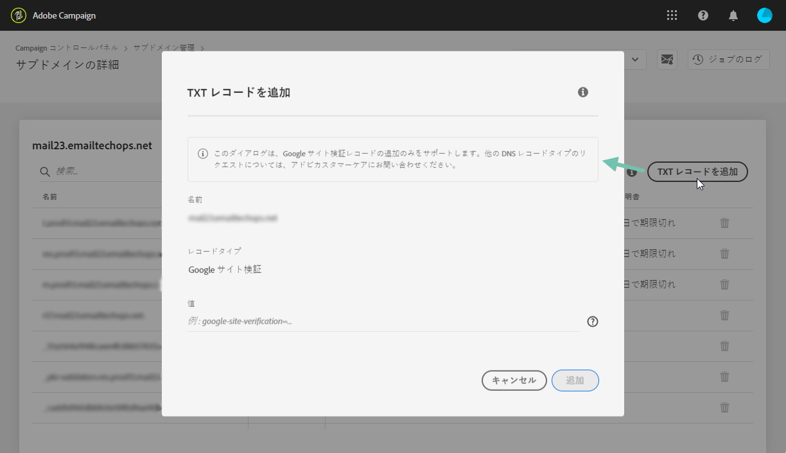
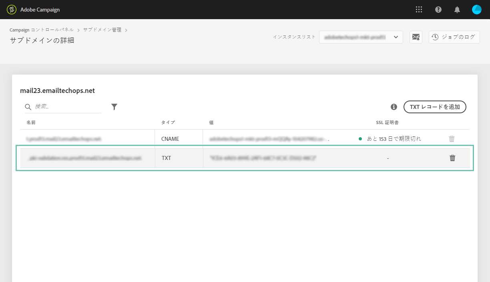

# Google サイト検証レコードを追加 {#adding-a-google-txt-record}

高い受信ボックス率および低いスパム率を確保するために、Google などの一部のサービスでは、ドメインを所有していることを検証するために、ドメイン設定に TXT レコードを追加する必要があります。

現在、Gmail は最も人気のあるメールアドレスプロバイダーの 1 つです。 Adobe Campaign では、Gmail アドレス宛てのメールの配信品質を確保して確実な配信をおこなうために、サブドメインに Google サイト検証用の特別な TXT レコードを追加して、サブドメインを確実に検証できます。

Gmail アドレス宛てのメール送信に使用するサブドメインに Google TXT レコードを追加するには、次の手順に従います。

1. サブドメインリストで、目的のサブドメインの横にある省略記号ボタンをクリックし、「**[!UICONTROL サブドメインの詳細]**」を選択します。

1. 「**[!UICONTROL TXT レコードを追加]**」ボタンをクリックし、「**[!UICONTROL レコードタイプ]**」ドロップダウンリストから「**[!UICONTROL Google サイト検証]**」を選択します。

1. G Suite 管理ツールで生成された値を入力します。 詳しくは、[G Suite 管理ヘルプ](https://support.google.com/a/answer/183895)を参照してください。

   

1. 「**[!UICONTROL 追加]**」ボタンをクリックして、確定します。

   

TXT レコードを追加したら、Google で検証する必要があります。 それには、G Suite 管理ツールに移動し、検証手順を実行します（[G Suite 管理ヘルプ](https://support.google.com/a/answer/183895)を参照）。

レコードを削除するには、レコードリストからレコードを選択し、「削除」ボタンをクリックします。

>[!NOTE]
>
>DNS レコードリストから削除できるのは、以前に追加したレコードのみです（この例では Google TXT レコード）。

 この機能をビデオで確認（[Campaign v7／v8](https://experienceleague.adobe.com/docs/campaign-classic-learn/control-panel/subdomains-and-certificates/google-txt-record-management.html?lang=ja#subdomains-and-certificates) または [Campaign Standard](https://experienceleague.adobe.com/docs/campaign-standard-learn/control-panel/subdomains-and-certificates/google-txt-record-management.html?lang=ja#subdomains-and-certificates) を使用）
