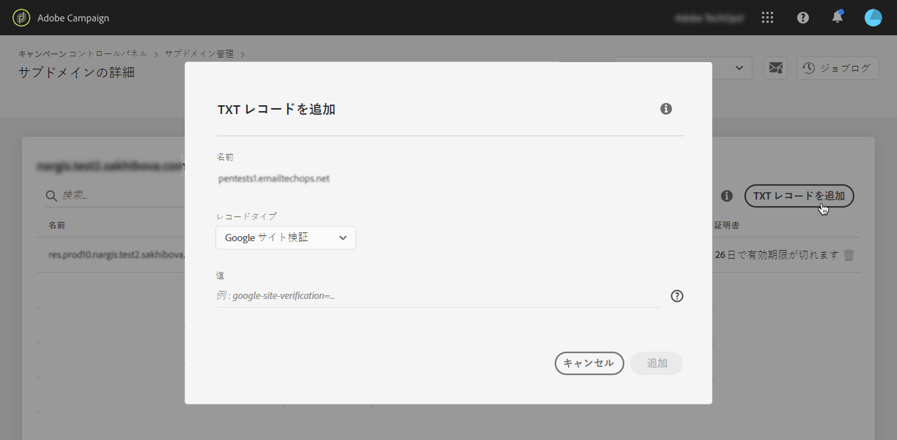

# TXTレコードの管理 {#managing-txt-records}

>[!CONTEXTUALHELP]
>id=&quot;cp_siteverification_add&quot;
>title=&quot;TXTレコードの管理&quot;
>abstract=&quot;Googleなどの一部のサービスでは、ドメインの所有者を確認するために、ドメイン設定にTXTレコードを追加する必要があります。&quot;

## TXTレコードについて {#about-txt-records}

TXTレコードは、ドメインに関するテキスト情報を提供するために使用されるDNSレコードの一種で、外部ソースから読み取ることができます。

高い受信トレイ率と低いスパム率を確保するために、Googleなどの一部のサービスでは、ドメインの所有者を確認するために、ドメイン設定にTXTレコードを追加する必要があります。

現在、Gmailは最も人気のある電子メールアドレスプロバイダーの1つです。 Gmailアドレスへの電子メールの配信品質と配信を確実に行うために、Adobe Campaignでは、Googleサイト検証用の特別なTXTレコードをサブドメインに追加して、確実に検証されるようにすることができます。

## サブドメイン用のGoogle TXTレコードの追加 {#adding-a-google-txt-record}

Google TXTレコードをGmailアドレスの電子メール送信に使用するサブドメインに追加するには、次の手順に従います。

1. カードに移動し **[!UICONTROL Subdomain and Certificates]** ます。

1. インスタンスを選択し、DNSレコードを追加するサブドメインの詳細を開きます。

   

1. ボタンをク **[!UICONTROL Add TXT record]** リックし、G Suiteの管理ツールで生成された値を入力します。 詳しくは、 [G Suite管理ヘルプを参照してください](https://support.google.com/a/answer/183895)。

   

1. 確認するボタン **[!UICONTROL Add]** をクリックします。

   

TXTレコードが追加されたら、Googleで確認する必要があります。 これを行うには、G Suite管理ツールに移動し、検証手順を起動します( [G Suite管理ヘルプを参照](https://support.google.com/a/answer/183895))。

レコードを削除するには、レコードリストからレコードを選択し、削除ボタンをクリックします。

>[!NOTE]
>
>DNSレコードリストから削除できるレコードは、以前に追加したレコード（この例ではGoogle TXTレコード）だけです。
