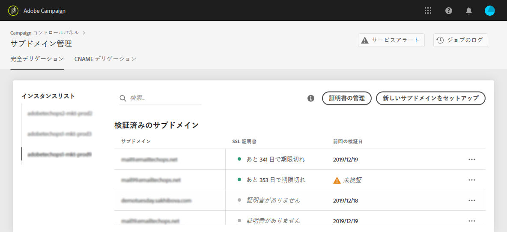
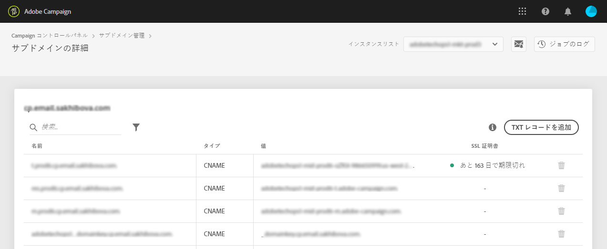

# サブドメインの SSL 証明書の監視 {#monitoring-ssl-certificates}

## SSL 証明書について {#about-ssl-certificates}

Adobe Campaign では、ランディングページ（特に、お客様の機密情報を収集するページ）をホストするサブドメインを保護することをお勧めします。

**SSL（Secure Socket Layer）暗号化**&#x200B;は、Adobe にデリゲートしたサブドメインを確実に保護します。お客様が Web フォームに記入したり Adobe Campaign がホストするランディングページに訪問したりする場合、デフォルトでは、情報は保護されていないプロトコル（HTTP）で送信されます。確実にセキュリティを強化するには、送信される情報を HTTPS プロトコルで保護します。例えば、「http://info.mywebsite.com/」サブドメインアドレスは、「https://info.mywebsite.com/」になります。

**SSL 証明書は、デリゲートされたサブドメイン自体にはインストールされません**。関連するサブドメイン（主に、ランディングページやリソースページなどをホストするサブドメイン）にインストールされます。

**SSL 証明書は、一定期間提供されます**（1 年間、60 日間など）。証明書の期限が切れると、ランディングページにアクセスしたりサブドメインからリソースを使用したりする際に問題が発生する可能性があります。これを回避するために、コントロールパネルを使用して、サブドメインの SSL 証明書を監視したり、その更新プロセスを開始したりできます。

## SSL 証明書の監視 {#monitoring-certificates}

>[!CONTEXTUALHELP]
>id=&quot;cp_subdomain_details&quot;
>title=&quot;サブドメインの詳細&quot;
>abstract=&quot;サブドメインの情報を取得します。&quot;

The status of your subdomains&#39; SSL certificates is available directly from the list of subdomains when selecting the **[!UICONTROL Subdomains & Certificates]** card.

サブドメインは、有効期限の視覚的情報と共に、日数で数えて SSL 証明書の有効期限が近い順に表示されます。

* **緑**：サブドメインには、今後 60 日以内に期限が切れる証明書はありません。
* **オレンジ**：1 つ以上のサブドメインに、今後 60 日以内に期限が切れる証明書があります。
* **赤**：1 つ以上のサブドメインに、今後 30 日以内に期限が切れる証明書があります。
* **グレー**：サブドメイン用の証明書がインストールされていません。

To get more details on a subdomain, click the **[!UICONTROL Subdomain Details]** button.
関連するすべてのサブドメインのリストが表示されます。通常、ランディングページやリソースページなどのサブドメインが含まれます。

The **[!UICONTROL Sender info]** tab provides information on the configured inboxes (Sender, Reply to, Error email).

サブドメインの SSL 証明書の 1 つに期限切れが近づいている場合、コントロールパネルから直接更新できます。詳しくは、[サブドメインの SSL 証明書の更新](../../subdomains-certificates/using/renewing-subdomain-certificate.md)を参照してください。

>[!IMPORTANT]
>
>コントロールパネルからの証明書の更新はベータ版で利用でき、通知なしに頻繁に更新や変更が行われる場合があります。

**関連トピック：**

* [SSL 証明書の追加（チュートリアルビデオ）](https://docs.adobe.com/content/help/en/campaign-learn/campaign-standard-tutorials/administrating/control-panel/adding-ssl-certificates.html)
* [サブドメインの SSL 証明書の更新](../../subdomains-certificates/using/renewing-subdomain-certificate.md)
* [サブドメインのブランディング](../../subdomains-certificates/using/subdomains-branding.md)
