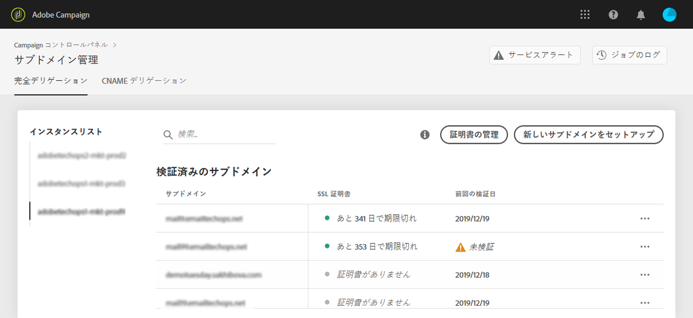
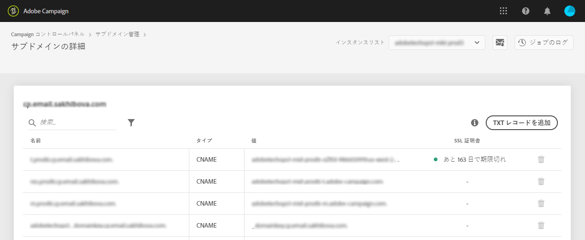

# サブドメインの SSL 証明書の監視 {#monitoring-ssl-certificates}

## SSL 証明書について {#about-ssl-certificates}

Adobe Campaign では、ランディングページ（特に、顧客の機密情報を収集するページ）をホストするサブドメインを保護することをお勧めします。

**SSL（Secure Socket Layer）暗号化**&#x200B;は、アドビのシステムで使用するように設定したサブドメインを確実に保護します。 お客様が Web フォームに記入したり Adobe Campaign がホストするランディングページに訪問したりする場合、デフォルトでは、情報が保護されないプロトコル（HTTP）で送信されます。 確実にセキュリティを強化するには、送信される情報を HTTPS プロトコルで保護します。 例えば、「http://info.mywebsite.com/」サブドメインアドレスは、「https://info.mywebsite.com/」になります。

**SSL 証明書は、設定されたサブドメイン自体にはインストールされません**。 関連するサブドメイン（主に、ランディングページやリソースページなどをホストするサブドメイン）にインストールされます。

**SSL 証明書は、一定期間提供されます**（1 年間、60 日間など）。 証明書の期限が切れると、ランディングページにアクセスしたりサブドメインからリソースを使用したりする際に問題が発生する可能性があります。 これを回避するために、コントロールパネルを使用して、サブドメインの SSL 証明書を監視したり、その更新プロセスを開始したりできます。

## SSL 証明書管理 {#management}

SSL 証明書の監視は、サブドメインのセキュリティを確保するための鍵となります。 コントロールパネルを使用すると、サブドメインの SSL 証明書を自分で直接インストールして更新することも、アドビにデリゲートして、この処理が自動的に実行されるようにすることもできます。ユーザー側でのアクションは不要になります。

アドビでは証明書を自動的に作成し、証明書の有効期限が切れる前に毎年更新するので、サブドメインの SSL 証明書の管理をアドビにデリゲートするよう強くお勧めします。 これにより、証明書を手動で管理する際に発生する可能性のあるエラーのリスクを軽減できます。 [詳しくは、アドビへのサブドメインの SSL 証明書のデリゲート方法を参照してください](delegate-ssl.md)

以下に、この操作をアドビにデリゲートする場合とは異なり、手動による証明書管理に関連する影響の包括的なリストを示します。

|       | 顧客管理の証明書 | アドビ管理の証明書 |
|  ---  |  ---  |  ---  |
| 証明書プロバイダー | サードパーティの証明機関 | AWS Certificate Manager 経由のアドビ |
| 手動の手順 | CSR の生成、証明書の購入、インストール | なし |
| 更新プロセス | 顧客の責任 | アドビが自動的に管理 |
| サブドメインのセキュリティ | 証明書をインストール／更新する場合を除き、ドメインにはセキュリティで保護されていないサブドメイン （トラッキング、ミラーおよびリソース）を含めることができます。 | すべての新しいドメイン（アドビ管理を選択した場合）では、デフォルトですべてのサブドメインが保護されます。 |
| 証明書のコスト | 顧客が証明書のコストを負担する | 無償 |

## SSL 証明書の監視 {#monitoring-certificates}

>[!CONTEXTUALHELP]
>id="cp_subdomain_details"
>title="サブドメインの詳細"
>abstract="サブドメインの SSL 証明書に関する情報を取得します。"

「**[!UICONTROL サブドメインおよび証明書]**」カードを選択すると、サブドメインのリストからサブドメインの SSL 証明書のステータスに直接アクセスできます。

サブドメインは、有効期限の視覚的情報と共に、日数で数えて SSL 証明書の有効期限が近い順に表示されます。

* **緑**：サブドメインには、今後 60 日以内に期限が切れる証明書はありません。
* **オレンジ**：1 つ以上のサブドメインに、今後 60 日以内に期限が切れる証明書があります。
* **赤**：1 つ以上のサブドメインに、今後 30 日以内に期限が切れる証明書があります。
* **グレー**：サブドメイン用の証明書がインストールされていません。

サブドメインの証明書の詳細を取得するには、**[!UICONTROL サブドメインの詳細]**ボタンをクリックします。
関連するすべてのサブドメインのリストが表示されます。 通常、ランディングページやリソースページなどのサブドメインが含まれます。

「**[!UICONTROL 送信者情報]**」タブには、設定済みの受信ボックス（送信者、返信先、エラーメール）に関する情報が表示されます。

サブドメインの SSL 証明書の 1 つに期限切れが近づいている場合、コントロールパネルから直接更新できます。 詳しくは、[サブドメインの SSL 証明書の更新](../../subdomains-certificates/using/renewing-subdomain-certificate.md)を参照してください。

**関連トピック：**

* [サブドメインの SSL 証明書の更新](../../subdomains-certificates/using/renewing-subdomain-certificate.md)
* [サブドメインのブランディング](../../subdomains-certificates/using/subdomains-branding.md)
