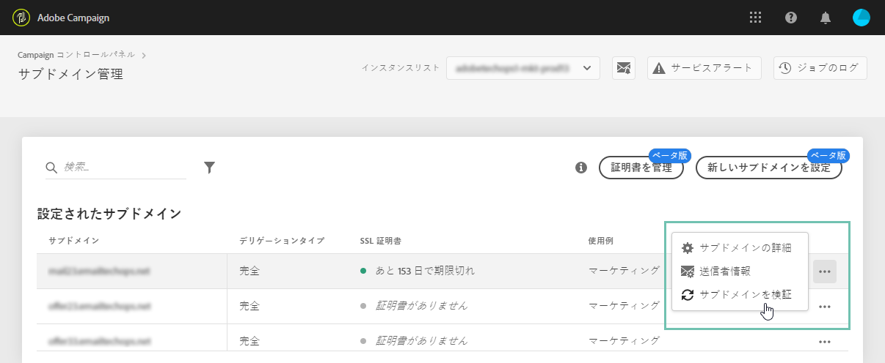

# サブドメインの監視 {#monitoring-subdomains}

>[!CONTEXTUALHELP]
>id="cp_subdomain_undelegate"
>title="デリゲートされたサブドメインの削除 "
>abstract="この画面では、Campaign コントロールパネルでデリゲートされたサブドメインを削除できます。 サブドメインの削除は元に戻すことができず、送信すると元に戻せなくなることに注意してください。  選択したインスタンスのプライマリドメインを削除しようとすると、置き換えるドメインを選択するよう求められます。"

サブドメインを監視して、Adobe Campaign で機能するようにすべてが正しく設定されていることを確認することが重要です。

各プロダクションインスタンスのサブドメインのリストには、「**[!UICONTROL サブドメインおよび証明書]**」カードを選択すると、直接アクセスできます。

「**[!UICONTROL 前回の検証日]**」列には、サブドメインが最後に検証された日が示されます。**...**／**[!UICONTROL サブドメインを検証]**&#x200B;ボタンをクリックすることで、いつでも検証を開始できます。

>[!IMPORTANT]
>
>アドビでは、証明日のないサブドメインの使用は、配信品質の問題がある可能性があるので、お勧めしません。

検証を開始すると、サブドメインが正しく設定されていることを確認するために、いくつかの処理が実行されます（インスタンステナントの確認、E メール送信テストなど）。

サブドメインの検証に失敗した場合は、さらに検証するためにアドビカスタマーケアにお問い合わせください。

**関連トピック：**

* [サブドメインの SSL 証明書の更新](../../subdomains-certificates/using/renewing-subdomain-certificate.md)
* [サブドメインのブランディング](../../subdomains-certificates/using/subdomains-branding.md)
