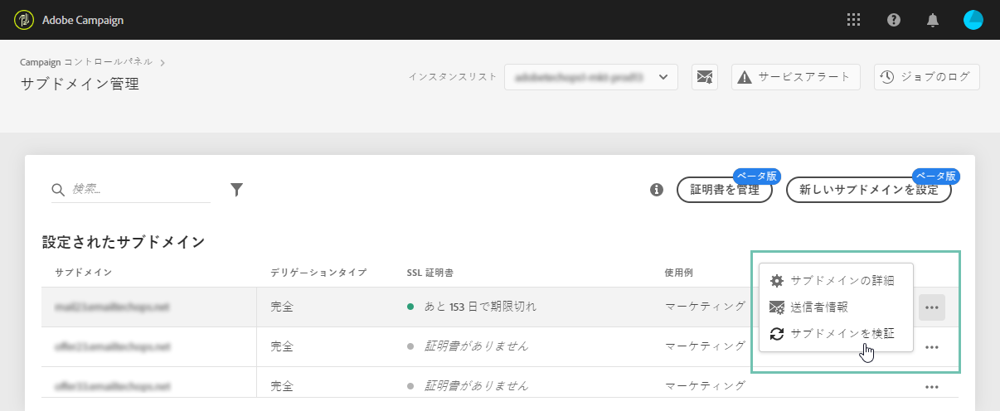

# サブドメインの監視 {#monitoring-subdomains}

サブドメインを監視して、Adobe Campaign で機能するようにすべてが正しく設定されていることを確認することが重要です。

各プロダクションインスタンスのサブドメインのリストには、「**[!UICONTROL サブドメインおよび証明書]**」カードを選択すると、直接アクセスできます。

「**[!UICONTROL 前回の検証日]**」列には、サブドメインが最後に検証された日が示されます。 **...**／**[!UICONTROL サブドメインを検証]**&#x200B;ボタンをクリックすることで、いつでも検証を開始できます。

>[!IMPORTANT]
>
>アドビでは、証明日のないサブドメインの使用は、配信品質の問題がある可能性があるので、お勧めしません。

検証を開始する際、サブドメインが正しく設定されていることを確認するのに複数の操作が実行されます（インスタンステナントの確認、メールの送信テストなど）。 サブドメインの検証に失敗した場合は、アドビカスタマーケアに連絡して、さらに調査を依頼してください。

**関連トピック：**

* [サブドメインの SSL 証明書の更新](../../subdomains-certificates/using/renewing-subdomain-certificate.md)
* [サブドメインのブランディング](../../subdomains-certificates/using/subdomains-branding.md)
