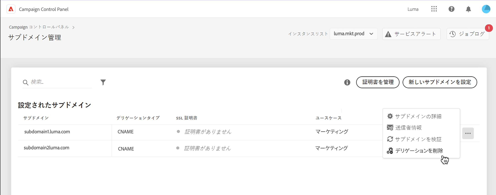
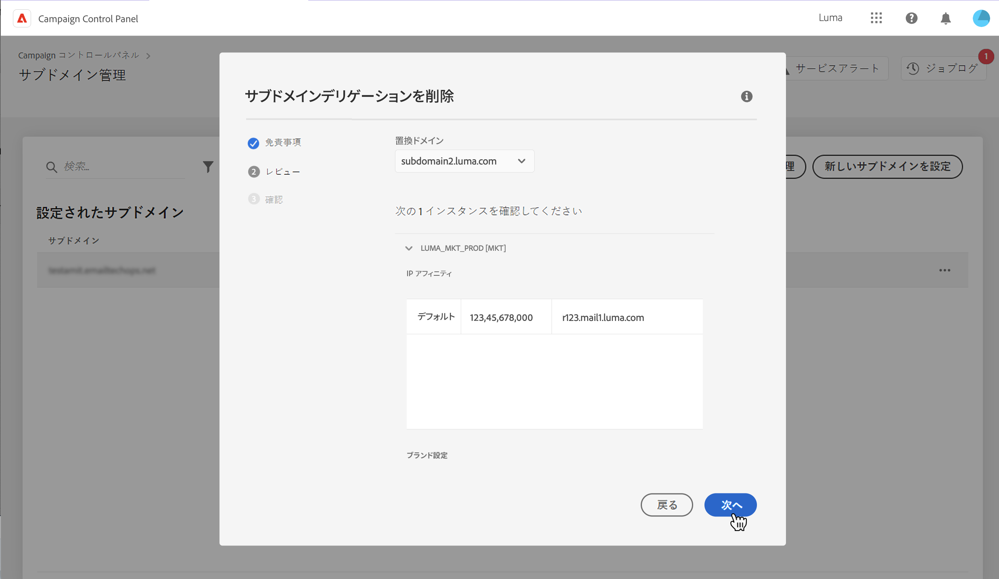
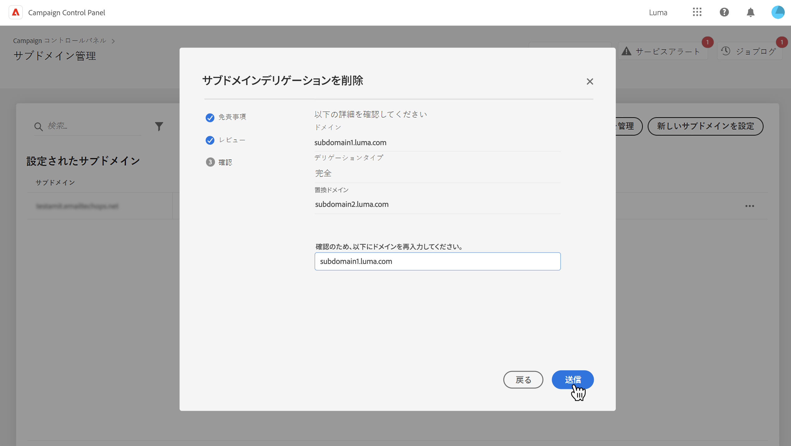
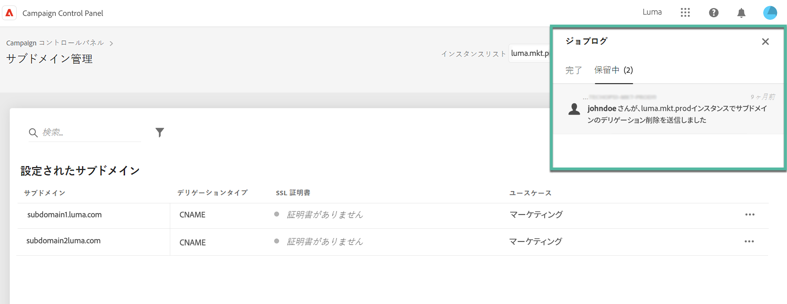
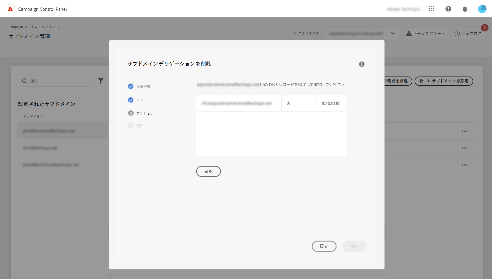

# アドビへのサブドメインのデリゲーションの削除 {#remove-delegated--subdomains}

>[!CONTEXTUALHELP]
>id="cp_subdomain_undelegate"
>title="サブドメインデリゲーションを削除"
>abstract="この画面では、アドビへのサブドメインのデリゲーションを削除できます。 このプロセスは取り消すことができず、実行が完了するまで元に戻せないことに注意してください。  選択したインスタンスのプライマリドメインのデリゲーションを削除しようとすると、代わりとなるドメインを選択するように求められます。"

コントロールパネルを使用すると、アドビに完全にデリゲートされたサブドメイン、または CNAME を使用してデリゲートされたサブドメインのデリゲーションを削除できます。

## 重要な注意事項 {#important}

先に進む前に、削除プロセスがトリガーされた後に発生する影響を慎重に検討してください。

* プロセスがトリガーされると、サブドメインのデリゲーションの削除は取り消すことができず、プロセスの実行が完了するまで元に戻せません。
* 別のサブドメインに対して類似のプロセスが処理中の場合は、他のサブドメインデリゲーションを削除できません。
* サブドメインで削除されたデリゲーションは、削除から 3 日が経過するまで再デリゲートできません。

## サブドメインデリゲーションの削除 {#steps}

アドビへのサブドメインのデリゲーションを削除するには、次の手順に従います。

1. 削除するドメインデリゲーションの横の省略記号ボタンをクリックし、「 」を選択します。 **[!UICONTROL 委任を削除]**.

   

1. 免責事項を確認し、アドビへのドメインデリゲーションの削除を了解します。

1. 関連する IP アフィニティやブランド設定など、サブドメインが関連付けられているインスタンスに関する情報を確認します。

   選択したインスタンスのプライマリドメインのデリゲーションを削除する場合は、**[!UICONTROL 代替ドメイン]**&#x200B;リストを使用して、代わりのドメインを選択する必要があります。

   「**[!UICONTROL 次へ]**」をクリックして、削除を続行します。

   

1. CNAME タイプのデリゲーションを削除する場合や、プライマリドメインを CNAME を使用してデリゲートされたドメインに置き換える場合、DNS レコードを管理するための追加の&#x200B;**[!UICONTROL アクション]**&#x200B;手順が表示されます。[詳しくは、この節を参照してください](#dns)

1. 表示される概要を確認します。削除を確定するには、デリゲーションを削除するドメインの URL を入力し、「**[!UICONTROL 送信]**」をクリックします。

   

デリゲーションの削除が開始されると、保留中のジョブは完了するまでジョブのログに表示されます。

## DNS レコード管理 {#dns}

CNAME を使用してドメインデリゲーションを設定するには、コントロールパネルで DNS サーバーに特定のレコードを追加する必要があります。[詳しくは、CNAME を使用してサブドメインを設定する方法を参照してください](setting-up-new-subdomain.md#use-cnames)

CNAME タイプのデリゲーションを削除する場合は、問題を回避するためにサーバーから&#x200B;**これらの DNS レコードを削除**&#x200B;する必要があります。さらに、プライマリサブドメインのデリゲーションを削除し、CNAME を使用してデリゲートされたドメインに置き換える場合は、サブドメインに設定されている IP アフィニティに応じて、サーバーに **DNS レコードを追加**&#x200B;する必要がある場合があります。

次の表に、削除するデリゲーションのタイプと、代替ドメインの設定に使用するデリゲーションのタイプに応じて実行するアクションを示します。

| 削除するデリゲーション | 代替ドメインのデリゲーション | 必要なアクション |
|  ---  |  ---  |  ---  |
| CNAME | 代替ドメインはありません | DNS レコードの削除 |
| CNAME | CNAME | DNS レコードの削除 DNS レコードの追加 *（IP アフィニティに応じてオプション）* |
| CNAME | 完全 | DNS レコードの削除 |
| 完全 | 代替ドメインはありません | アクションは不要です |
| 完全 | CNAME | DNS レコードの追加 *（IP アフィニティに応じてオプション）* |
| 完全 | 完全 | アクションは不要です |

{style="table-layout:auto"}

委任を削除するためにこれらのアクションの 1 つが必要な場合は、 **[!DNL Action]** 委任の削除を確認する前に、手順が表示されます。 この画面には、コンテキストに応じて、削除または追加する DNS レコードが表示されます。

### DNS レコードの削除

1. DNS サーバーに移動し、コントロールパネルに表示されているレコードを削除します。
1. コントロールパネルに戻り、「**[!UICONTROL 次へ]**」をクリックしてデリゲーションの削除を続行します。

### DNS レコードの追加

1. DNS サーバーに移動し、コントロールパネルに表示されているレコードを追加します。
1. DNS の追加が有効になるまで待機します。
1. コントロールパネルに戻り、「**[!UICONTROL 確認]**」をクリックします。
1. レコードの追加を正常に確認したら、「**[!UICONTROL 次へ]**」をクリックしてデリゲーションの削除に進みます。

## エラーコード {#FAQ}

この節では、サブドメインのデリゲーションを削除しようとしたときに表示される可能性があるエラーメッセージの一覧を示します。

| エラーコード | メッセージ | 説明 |
|  ---  |  ---  |  ---  |
| 8002 | 類似した重複するリクエストが処理中なので、リクエストされたデリゲートドメインの削除には対処できません。3 日後に試してください | サブドメインデリゲーションの削除ジョブが、選択したインスタンスに対して既に処理中です。新しい削除ジョブを開始するには、3 日間待ちます。 |
| 8003 | このインスタンスでは、リクエストされたデリゲートドメインの削除はサポートされていません。 | 技術的な問題により、選択したサブドメインではデリゲーションの削除がサポートされていません。カスタマーケアにお問い合わせください。 |
| 8004 | このインスタンスにはドメインが 1 つしかないので、リクエストされたデリゲートドメインの削除は許可されていません。 | 選択したインスタンスでは、デリゲートされたサブドメインは 1 つだけです。 デリゲーションの削除は許可されていません。 |
| 8005 | この設定では、リクエストされたデリゲートドメインの削除はサポートされていません。 | 技術的な問題により、選択したサブドメインではデリゲーションの削除がサポートされていません。カスタマーケアにお問い合わせください。 |
| 8006 | 不明な理由により、リクエストされたデリゲートドメインの削除は許可されていません。カスタマーケアにお問い合わせください。 | 不明な問題により、選択したインスタンスではデリゲーションの削除がサポートされていません。カスタマーケアにお問い合わせください。 |
