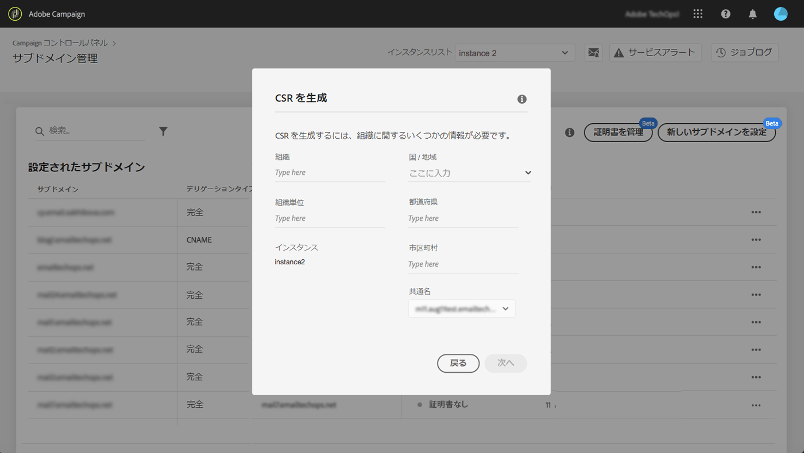

# サブドメインの SSL 証明書の更新 {#renewing-subdomains-ssl-certificates}

>[!CONTEXTUALHELP]
>id="cp_add_ssl_certificate"
>title="SSL 証明書を追加"
>abstract="SSL証明書を追加するには、CSRを生成し、サブドメイン用のSSL証明書を購入して、証明書バンドルをインストールする必要があります。"
>additional-url="https://docs.adobe.com/content/help/en/control-panel/using/subdomains-and-certificates/renewing-subdomain-certificate.html#generating-csr" text="証明書署名要求（CSR）の生成 "
>additional-url="https://docs.adobe.com/content/help/en/control-panel/using/subdomains-and-certificates/renewing-subdomain-certificate.html#installing-ssl-certificate" text="SSL証明書のインストール方法"

>[!IMPORTANT]
>
>コントロールパネルから使用できるサブドメインのデリゲーションは、ベータ版です。通知なしに頻繁に更新および変更される可能性があります。

## 証明書の更新について {#about-certificate-renewal-process}

SSL 証明書の更新プロセスには、以下の 3 ステップがあります。

1. **証明書署名要求（CSR）の生成**
アドビカスタマーケアによって、CSR が生成されます。CSR を生成するために必要な情報（共通名、組織名および住所など）を提供する必要があります。
1. **SSL 証明書の購入**
CSR が生成されると、ダウンロードでき、会社が承認する認証局から SSL 証明書を購入する際に使用できます。
1. **SSL 証明書のインストール**
SSL 証明書を購入したら、目的のサブドメインにインストールできます。

## 証明書署名要求（CSR）の生成 {#generating-csr}

>[!CONTEXTUALHELP]
>id="cp_generate_csr"
>title="CSR を生成"
>abstract="証明書の購入前に、保護する予定のインスタンスとサブドメインに対して、証明書署名要求を生成する必要があります。"

>[!CONTEXTUALHELP]
>id="cp_select_subdomains"
>title="CSR のサブドメインの選択"
>abstract="証明書署名要求に、特定のサブドメインをすべて含めるか、またはのみ含めるかを選択できます。 選択したサブドメインのみが、購入したSSL証明書を使用して認証されます。"
>additional-url="https://docs.adobe.com/content/help/en/control-panel/using/subdomains-and-certificates/renewing-subdomain-certificate.html#generating-csr" text="証明書署名要求（CSR）の生成 "
>additional-url="https://docs.adobe.com/content/help/ja-JP/control-panel/using/subdomains-and-certificates/subdomains-branding.html" text="サブドメインのブランディングについて"

証明書署名要求（CSR）を生成するには、次の手順に従います。

1. 「**[!UICONTROL サブドメインおよび証明書]**」カードで、目的のインスタンスを選択してから、「**[!UICONTROL 証明書を管理]**」ボタンをクリックします。

   

1. Select **[!UICONTROL 1 - Generate a CSR]**, then click **[!UICONTROL Next]** to launch the wizard that will guide you through the CSR generation process.

   

1. CSR を生成するために必要なすべての詳細と共に、フォームが表示されます。

   証明書を確実に更新するために、要求された情報をすべて正確に入力していることを確認して（必要に応じて、社内チーム、セキュリティおよび IT チームに問い合わせます）から、「**[!UICONTROL 次へ]**」をクリックします。

   * **[!UICONTROL 組織]**：正式な組織名。
   * **[!UICONTROL 組織単位]**：サブドメインにリンクされた単位（例：マーケティング、IT）。
   * **[!UICONTROL インスタンス]**（事前入力済み）：サブドメインに関連付けられた Campaign インスタンスの URL。
   

1. CSR に含めるサブドメインを選択し、「**[!UICONTROL OK]**」をクリックします。

   

1. 選択したサブドメインがリストに表示されます。それぞれに対して、含めるサブドメインを選択し、「**[!UICONTROL 次へ]**」をクリックします。

   

1. CSR に含めるサブドメインの概要が表示されます。「**[!UICONTROL 送信]**」をクリックし、要求を確認します。

   

1. 選択項目に対応する .csr ファイルが自動的に生成され、ダウンロードされます。これで、会社が承認した認証局から SSL 証明書を購入するために使用できます。

   >[!NOTE]
   >
   >CSR は、保存またはダウンロードされない場合に失われ、再生成する必要があります。

## CSR を使用した証明書の購入 {#purchasing-certificate}

コントロールパネルから証明書署名要求（CSR）を取得した後、組織によって承認されている認証局から SSL 証明書を購入します。

## SSL 証明書のインストール {#installing-ssl-certificate}

>[!CONTEXTUALHELP]
>id="cp_install_ssl_certificate"
>title="SSL 証明書をインストール"
>abstract="組織が承認した認証局から購入したSSL証明書をインストールします。"
>additional-url="https://docs.adobe.com/content/help/ja-JP/control-panel/using/subdomains-and-certificates/subdomains-branding.html" text="サブドメインのブランディングについて"

SSL 証明書を購入したら、インスタンスにインストールできます。先に進む前に、次の前提条件を必ず確認してください。

* 証明書署名要求（CSR）は、コントロールパネルから生成されている必要があります。そうでない場合、コントロールパネルから証明書をインストールできなくなります。
* 証明書署名要求（CSR）は、アドビにデリゲートされたサブドメインと一致する必要があります。例えば、デリゲートされたもの以外のサブドメインを含めることはできません。
* 証明書の日付は現在の日付である必要があります。将来の日付になっている証明書はインストールできません。証明書は有効期限が切れていない（開始日と終了日が有効）必要があります。
* 証明書は、Comodo、DigiCert、GoDaddy などの信頼できる認証局（CA）によって発行される必要があります。
* 証明書のサイズは 2048 bit、アルゴリズムは RSA である必要があります。
* 証明書は X.509 PEM 形式である必要があります。
* SAN 証明書がサポートされています。
* ワイルドカード証明書はサポートされていません。
* ZIP ファイルまたは証明書をパスワードで保護しないでください。
* ZIP ファイルには、できれば個々のファイルに以下の項目のみを含める必要があります。
   * エンドエンティティ証明書。
   * 中間証明書チェーン（適切な順序で配列）。
   * ルート証明書（オプション）。

証明書をインストールするには、次の手順に従います。

1. 「**[!UICONTROL サブドメインおよび証明書]**」カードで、目的のインスタンスを選択してから、「**[!UICONTROL 証明書を管理]**」ボタンをクリックします。

   

1. Select **[!UICONTROL 3 - Install Certificate Bundle]**, then click **[!UICONTROL Next]** to launch the wizard that will guide you through the certificate installation process.

   

1. インストールする証明書が含まれている .zip ファイルを選択し、「**[!UICONTROL 送信]**」をクリックします。

   

>[!NOTE]
>
>CSR に含まれるすべてのドメイン／サブドメインに証明書がインストールされます。証明書に存在する追加のドメイン／サブドメインは考慮されません。

SSL 証明書がインストールされると、それに応じて証明書の有効期限とステータスアイコンが更新されます。

**関連トピック：**

* [SSL 証明書の追加（チュートリアルビデオ）](https://docs.adobe.com/content/help/en/campaign-learn/campaign-standard-tutorials/administrating/control-panel/adding-ssl-certificates.html)
* [サブドメインのブランディング](../../subdomains-certificates/using/subdomains-branding.md)
* [サブドメインの監視](../../subdomains-certificates/using/monitoring-subdomains.md)