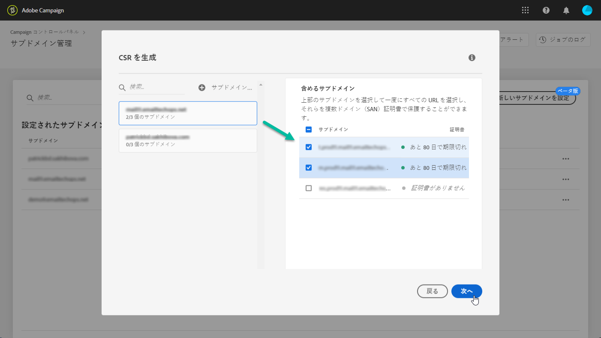
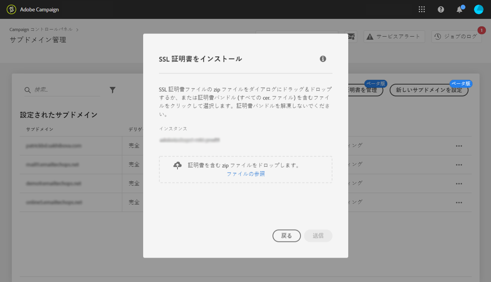

# サブドメインの SSL 証明書の更新 {#renewing-subdomains-ssl-certificates}

>[!CONTEXTUALHELP]
>id="cp_add_ssl_certificate"
>title="SSL 証明書の更新"
>abstract="SSL 証明書を更新するには、CSR を生成し、サブドメイン用の SSL 証明書を購入して、証明書バンドルをインストールする必要があります。"
>additional-url="://experienceleague.adobe.com/docs/control-panel/using/subdomains-and-certificates/renewing-subdomain-certificate.html?lang=ja#generating-csr" text="証明書署名要求（CSR）の生成"
>additional-url="://experienceleague.adobe.com/docs/control-panel/using/subdomains-and-certificates/renewing-subdomain-certificate.html?lang=ja#installing-ssl-certificate" text="SSL 証明書のインストール"

## 証明書の更新について {#about-certificate-renewal-process}

>[!IMPORTANT]
>
>コントロールパネルからサブドメインを設定できる機能はベータ版であり、予告なく頻繁に更新や変更を行われる可能性があります。
>
>この機能は、Campaign v8 では使用できません。

SSL 証明書の更新プロセスには、以下の 3 ステップがあります。

1. **証明書署名要求（CSR）の生成**
アドビカスタマーケアが CSR を生成します。CSR を生成するために必要な情報（共通名、組織名および住所など）を提供する必要があります。
1. **SSL 証明書の購入**
CSR が生成されると、ダウンロードして、会社が承認する認証局から SSL 証明書を購入する際に使用できます。
1. **SSL 証明書のインストール**
SSL 証明書を購入したら、目的のサブドメインにインストールします。

 [Campaign Classic](https://experienceleague.adobe.com/docs/campaign-classic-learn/control-panel/subdomains-and-certificates/adding-ssl-certificates.html#subdomains-and-certificates) または [Campaign Standard ](https://experienceleague.adobe.com/docs/campaign-standard-learn/control-panel/subdomains-and-certificates/adding-ssl-certificates.html#adding-ssl-certificates) を使用してこの機能をビデオで確認する

## 証明書署名要求（CSR）の生成 {#generating-csr}

>[!CONTEXTUALHELP]
>id="cp_generate_csr"
>title="CSR の生成"
>abstract="証明書署名要求は、証明書を購入する前に、保護する予定のインスタンスおよびサブドメイン用に生成する必要があります。"

>[!CONTEXTUALHELP]
>id="cp_select_subdomains"
>title="CSR のサブドメインの選択"
>abstract="証明書署名要求に、すべてのサブドメインまたは特定のサブドメインのみを含めるよう選択できます。選択したサブドメインのみが、購入した SSL 証明書を通じて認証されます。"
>additional-url="https://experienceleague.adobe.com/docs/control-panel/using/subdomains-and-certificates/renewing-subdomain-certificate.html#generating-csr" text="証明書署名要求（CSR）の生成"
>additional-url="https://experienceleague.adobe.com/docs/control-panel/using/subdomains-and-certificates/subdomains-branding.html?lang=ja" text="サブドメインのブランディングについて"

証明書署名要求（CSR）を生成するには、次の手順に従います。

1. 「**[!UICONTROL サブドメインおよび証明書]**」カードで、目的のインスタンスを選択してから、「**[!UICONTROL 証明書を管理]**」ボタンをクリックします。

   

1. 「**[!UICONTROL 1 - CSR を生成]**」を選択してから、「**[!UICONTROL 次へ]**」をクリックし、CSR 生成プロセスの手順を示すウィザードを起動します。

   

1. CSR を生成するために必要なすべての詳細と共に、フォームが表示されます。

   証明書を確実に更新するため、要求された情報を必ずすべて正確に入力して（必要に応じて、社内チーム、セキュリティおよび IT チームに確認）、「**[!UICONTROL 次へ]**」をクリックします。

   * **[!UICONTROL 組織]**：正式な組織名。
   * **[!UICONTROL 組織単位]**：サブドメインにリンクされた単位（例：マーケティング、IT）。
   * **[!UICONTROL インスタンス]**（事前入力済み）：サブドメインに関連付けられた Campaign インスタンスの URL。

   

1. CSR に含めるサブドメインを選択し、「**[!UICONTROL OK]**」をクリックします。

   

1. 選択したサブドメインがリストに表示されます。それぞれに対して、含めるサブドメインを選択し、「**[!UICONTROL 次へ]**」をクリックします。

   

1. CSR に含めるサブドメインの概要が表示されたら、「**[!UICONTROL 送信]**」をクリックして要求を確定します。

   

1. 選択項目に対応する .csr ファイルが自動的に生成され、ダウンロードされます。これで、会社が承認した認証局から SSL 証明書を購入するために使用できます。

   >[!NOTE]
   >
   >CSR は、保存またはダウンロードされない場合に失われ、再生成する必要があります。

## CSR を使用した証明書の購入 {#purchasing-certificate}

コントロールパネルから証明書の署名を要求（CSR）を取得した後、組織によって承認されている認証局から SSL 証明書を購入します。

## SSL 証明書のインストール {#installing-ssl-certificate}

>[!CONTEXTUALHELP]
>id="cp_install_ssl_certificate"
>title="SSL 証明書のインストール"
>abstract="組織が承認した認証局から購入した SSL 証明書をインストールします。"
>additional-url="https://experienceleague.adobe.com/docs/control-panel/using/subdomains-and-certificates/subdomains-branding.html" text="サブドメインのブランディングについて"

SSL 証明書を購入したら、インスタンスにインストールできます。先に進む前に、次の前提条件を必ず確認してください。

* 証明書署名要求（CSR）は、コントロールパネルから生成されている必要があります。そうでない場合、コントロールパネルから証明書をインストールできなくなります。
* 証明書署名要求（CSR）は、アドビと機能するように設定されたサブドメインと一致する必要があります。例えば、設定されたもの以外のサブドメインを含めることはできません。
* 証明書の日付は現在の日付である必要があります。将来の日付になっている証明書はインストールできません。証明書は有効期限が切れていない（開始日と終了日が有効）必要があります。
* 証明書は、Comodo、DigiCert、GoDaddy などの信頼できる認証局（CA）によって発行される必要があります。
* 証明書のサイズは 2048 bit、アルゴリズムは RSA である必要があります。
* 証明書は X.509 PEM 形式である必要があります。
* SAN 証明書がサポートされています。
* ワイルドカード証明書はサポートされていません。
* ZIP ファイルまたは証明書をパスワードで保護しないでください。
* ZIP ファイルには、できれば個々のファイルに以下の項目のみを含める必要があります。
   * エンドエンティティ証明書。
   * 中間証明書チェーン（適切な順序で配列）。
   * ルート証明書（オプション）。

証明書をインストールするには、次の手順に従います。

1. 「**[!UICONTROL サブドメインおよび証明書]**」カードで、目的のインスタンスを選択してから、「**[!UICONTROL 証明書を管理]**」ボタンをクリックします。

   

1. 「**[!UICONTROL 3 - 証明書バンドルのインストール]**」を選択してから、「**[!UICONTROL 次へ]**」をクリックし、証明書のインストールプロセスの手順を示すウィザードを起動します。

   

1. インストールする証明書が含まれている .zip ファイルを選択し、「**[!UICONTROL 送信]**」をクリックします。

   

>[!NOTE]
>
>CSR に含まれるすべてのドメイン／サブドメインに証明書がインストールされます。証明書内に記載されている追加のドメイン／サブドメインは考慮されません。

SSL 証明書がインストールされると、それに応じて証明書の有効期限とステータスアイコンが更新されます。

**関連トピック：**

* [サブドメインのブランディング](../../subdomains-certificates/using/subdomains-branding.md)
* [サブドメインの監視](../../subdomains-certificates/using/monitoring-subdomains.md)
