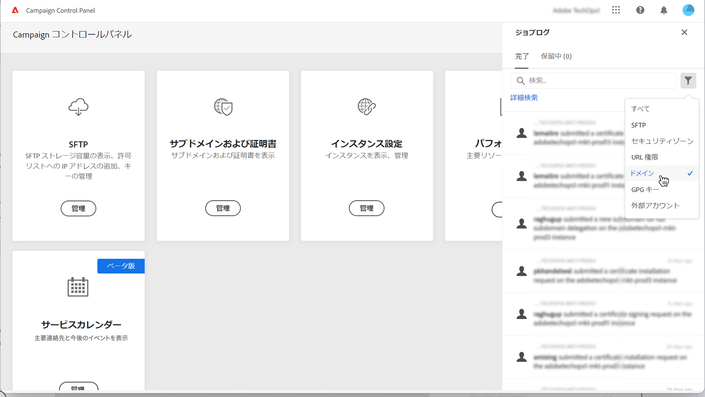
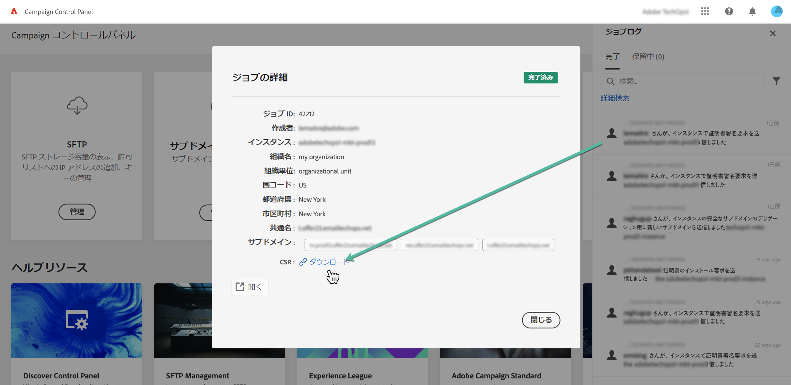

# SSL 証明書を更新 {#renewing-subdomains-ssl-certificates}

>[!CONTEXTUALHELP]
>id="cp_add_ssl_certificate"
>title="SSL 証明書を更新"
>abstract="SSL 証明書を更新するには、CSR を生成し、サブドメインの SSL 証明書を購入して、証明書バンドルをインストールする必要があります。この操作は、証明書をアドビにデリゲートせずに手動で管理することを選択した場合にのみ必要です。 "

>[!NOTE]
>
>サブドメインの SSL 証明書の更新は、この処理をアドビにデリゲートせずに自分で証明書を管理することを選択した場合にのみ必要です。アドビでは証明書を自動的に作成し、証明書の有効期限が切れる前に毎年更新するので、サブドメインの SSL 証明書の管理をアドビにデリゲートするよう強くお勧めします。[詳しくは、SSL 証明書の管理を参照してください](monitoring-ssl-certificates.md#management)

SSL 証明書の更新プロセスは、次の 3 ステップで構成されます。

1. **証明書署名要求（CSR）の生成**

   証明書署名要求は、証明書を購入する前に、保護する予定のインスタンスおよびサブドメイン用に生成する必要があります。CSR の生成に必要な情報（共通名、組織名、住所など）を提供する必要があります。[詳細情報](#generate)

1. **SSL 証明書の購入**

   CSR が生成されたら、それを使用して、会社が承認した認証局から SSL 証明書を購入できます。

1. **SSL 証明書のインストール**

   購入した SSL 証明書を目的のサブドメインにインストールして、サブドメインを保護します。 [詳細情報](#install)

 この機能をビデオで確認（[Campaign v7／v8](https://experienceleague.adobe.com/docs/campaign-classic-learn/control-panel/subdomains-and-certificates/adding-ssl-certificates.html?lang=ja#subdomains-and-certificates) または [Campaign Standard](https://experienceleague.adobe.com/docs/campaign-standard-learn/control-panel/subdomains-and-certificates/adding-ssl-certificates.html?lang=ja#adding-ssl-certificates) を使用）

**関連トピック：**

* [配信品質のベストプラクティスガイド - Adobe Campaign の SSL 証明書リクエストプロセス](https://experienceleague.adobe.com/docs/deliverability-learn/deliverability-best-practice-guide/additional-resources/campaign/ac-ssl-certificate-request.html?lang=ja)
* [サブドメインのブランディング](../../subdomains-certificates/using/subdomains-branding.md)
* [サブドメインの監視](../../subdomains-certificates/using/monitoring-subdomains.md)

## CSR を生成 {#generate}

>[!CONTEXTUALHELP]
>id="cp_generate_csr"
>title="CSR の生成"
>abstract="証明書署名要求は、証明書を購入する前に、保護する予定のインスタンスおよびサブドメイン用に生成する必要があります。"

>[!CONTEXTUALHELP]
>id="cp_select_subdomains"
>title="CSR のサブドメインの選択"
>abstract="証明書署名要求に、すべてのサブドメインまたは特定のサブドメインのみを含めるよう選択できます。選択したサブドメインのみが、購入した SSL 証明書を通じて認証されます。"

証明書署名要求（CSR）を生成するには、次の手順に従います。

1. 「**[!UICONTROL サブドメインおよび証明書]**」カードで、目的のインスタンスを選択してから、「**[!UICONTROL 証明書を管理]**」ボタンをクリックします。

   

1. 「**[!UICONTROL 1 - CSR を生成]**」を選択してから、「**[!UICONTROL 次へ]**」をクリックし、CSR 生成プロセスの手順を示すウィザードを起動します。

   

1. CSR を生成するために必要なすべての詳細と共に、フォームが表示されます。

   証明書を確実に更新するため、要求された情報を必ずすべて正確に入力して（必要に応じて、社内チーム、セキュリティおよび IT チームに確認）、「**[!UICONTROL 次へ]**」をクリックします。

   * **[!UICONTROL 組織]**：正式な組織名。
   * **[!UICONTROL 組織単位]**：サブドメインにリンクされた単位（例：マーケティング、IT）。
   * **[!UICONTROL インスタンス]**（事前入力済み）：サブドメインに関連付けられた Campaign インスタンスの URL。
   * **[!UICONTROL 共通名]**：デフォルトでは共通名が選択されています。必要に応じて、いずれかのサブドメインを選択できます。

   

1. CSR に含めるサブドメインを選択し、「**[!UICONTROL OK]**」をクリックします。

   

1. 選択したサブドメインがリストに表示されます。それぞれに対して、含めるサブドメインを選択し、「**[!UICONTROL 次へ]**」をクリックします。

   

1. CSR に含めるサブドメインの概要が表示されたら、「**[!UICONTROL 送信]**」をクリックしてリクエストを確定します。

   

   >[!NOTE]
   >
   >「**[!UICONTROL CSR コンテンツをコピー]**」ボタンを使用すると、CSR に関連するすべての情報（組織 ID、インスタンス、組織名、共通名、含まれるサブドメインなど）をコピーできます。

1. 選択した項目に対応する .csr ファイルが自動的に生成され、ダウンロードされます。これを使用して、会社が承認した認証局から SSL 証明書を購入できるようになりました。CSR を再度ダウンロードする必要がある場合は、[この節](#download)で説明している手順に従ってください。

CSR が生成されてダウンロードされたら、それを使用して、組織が承認した認証局から SSL 証明書を購入できます。

SSL 証明書を購入したら、それをインスタンスにインストールして、サブドメインを保護できます。[詳細情報](#install)

## CSR のダウンロード {#download}

SSL 証明書を購入するには、まず証明書署名要求をダウンロードする必要があります。CSR は、生成されると自動的にダウンロードされます。また、ジョブのログからいつでも再度ダウンロードできます。

1. 「**[!UICONTROL ジョブのログ]**」で「**[!UICONTROL 完了]** 」タブを選択し、リストをフィルタリングして、サブドメイン管理に関連するジョブを表示します。

   

1. CSR の生成に対応するジョブを開き、「**[!UICONTROL ダウンロード]**」リンクをクリックして .csr ファイルを取得します。

   

## SSL 証明書のインストール {#install}

>[!CONTEXTUALHELP]
>id="cp_install_ssl_certificate"
>title="SSL 証明書のインストール"
>abstract="組織で承認された認証局から購入した SSL 証明書をインストールします。"

SSL 証明書を購入したら、インスタンスにインストールできます。先に進む前に、次の前提条件を必ず確認してください。

* 証明書署名要求（CSR）は、コントロールパネルから生成されている必要があります。そうでない場合、コントロールパネルから証明書をインストールできなくなります。
* 証明書署名要求（CSR）は、アドビと機能するように設定されたサブドメインと一致する必要があります。例えば、設定された数を超えるサブドメインを含めることはできません。
* 証明書の日付は現在の日付である必要があります。将来の日付になっている証明書はインストールできません。証明書は有効期限が切れていない（開始日と終了日が有効）必要があります。
* 証明書は、Comodo、DigiCert、GoDaddy などの信頼できる認証局（CA）によって発行される必要があります。
* 証明書のサイズは 2048 bit、アルゴリズムは RSA である必要があります。
* 証明書は X.509 PEM 形式である必要があります。
* SAN 証明書がサポートされています。
* ワイルドカード証明書はサポートされていません。
* ZIP ファイルまたは証明書をパスワードで保護しないでください。
* ZIP ファイルには、できれば個々のファイルに以下の項目のみを含める必要があります。
   * エンドエンティティ証明書。
   * 中間証明書チェーン（適切な順序で配列）。
   * ルート証明書（オプション）。

証明書をインストールするには、次の手順に従います。

1. 「**[!UICONTROL サブドメインおよび証明書]**」カードで、目的のインスタンスを選択してから、「**[!UICONTROL 証明書を管理]**」ボタンをクリックします。

   

1. 「**[!UICONTROL 3 - 証明書バンドルのインストール]**」を選択してから、「**[!UICONTROL 次へ]**」をクリックし、証明書のインストールプロセスの手順を示すウィザードを起動します。

   

1. インストールする証明書が含まれている .zip ファイルを選択し、「**[!UICONTROL 送信]**」をクリックします。

   

>[!NOTE]
>
>CSR に含まれるすべてのドメイン／サブドメインに証明書がインストールされます。証明書内に記載されている追加のドメイン／サブドメインは考慮されません。

SSL 証明書がインストールされると、それに応じて証明書の有効期限とステータスアイコンが更新されます。
