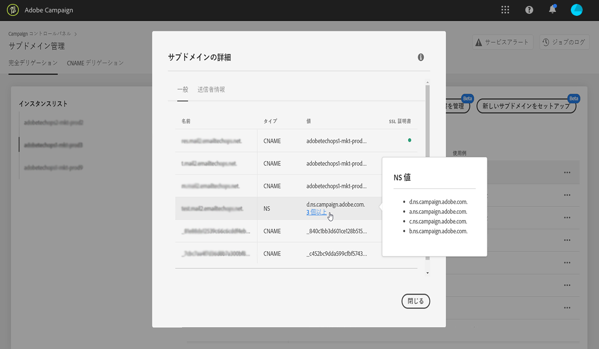
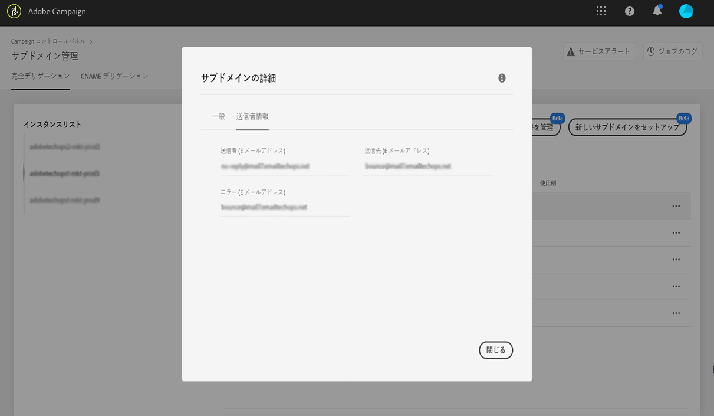

# 新しいサブドメインの設定 {#setting-up-subdomain}

>[!CONTEXTUALHELP]
>id=&quot;cp_subdomain_management&quot;
>title=&quot;新しいサブドメインの設定と証明書の管理&quot;
>abstract=&quot;Adobe Campaign で E メールの送信またはランディングページのパブリッシュを開始するには、新しいサブドメインを設定してサブドメインの SSL 証明書を管理する必要があります。&quot;
>additional-url=&quot;https://docs.adobe.com/content/help/ja-JP/control-panel/using/subdomains-and-certificates/monitoring-ssl-certificates.html&quot; text=&quot;サブドメインの SSL 証明書の監視方法&quot;

>[!IMPORTANT]
>
>コントロールパネルから使用できるサブドメインのデリゲーションは、ベータ版です。通知なしに頻繁に更新および変更される可能性があります。

## 完全なサブドメインデリゲーション {#full-subdomain-delegation}

コントロールパネルを使用すると、サブドメインを Adobe Campaign に完全にデリゲートできます。それには、次の手順に従います。

>[!NOTE]
>
>選択したインスタンスにサブドメインが事前に設定されていない場合、アドビにデリゲートされた最初のサブドメインがそのインスタンスの&#x200B;**プライマリサブドメイン**&#x200B;になり、後で変更することはできません。
>
>そのプライマリサブドメインを使用して、リバース DNS レコードがその他のサブドメインに対して作成されます。その他のサブドメインの返信アドレスとバウンスアドレスは、プライマリサブドメインから生成されます。

1. カードで、 **[!UICONTROL Subdomains & Certificates]** 目的の実稼働インスタンスを選択し、をクリックしま **[!UICONTROL Setup new subdomain]**&#x200B;す。

   

   >[!NOTE]
   >
   >サブドメインデリゲーションは、**プロダクション**&#x200B;インスタンスでのみ使用できます。

1. Click **[!UICONTROL Next]** to confirm the full delegation method.

   

   >[!NOTE]
   >
   >[CNAME](#use-cnames) およびカスタムメソッドは、現在、コントロールパネルではサポートされていません。

1. 組織で使用するホスティングソリューションに、目的のサブドメインとネームサーバーを作成します。これをおこなうには、ウィザードに表示される Adobe ネームサーバー情報をコピー＆ペーストします。ホスティングソリューションでのサブドメインの作成方法について詳しくは、[チュートリアルビデオ](https://video.tv.adobe.com/v/30175?captions=jpn)を参照してください。

   >[!IMPORTANT]
   >
   >ネームサーバーを設定する際は、**ルートサブドメインをアドビにデリゲートしない**&#x200B;ようにしてください。そうしないと、ドメインが機能できるのがアドビのみになります。例えば、組織の従業員に内部 E メールを送信するなど、他の使用はできなくなります。
   >
   >また、この新し **いサブドメイン用に別のゾーンファイルを作成しない** でください。

   

   Once the subdomain is created with the corresponding Adobe nameserver information, click **[!UICONTROL Next]**.

1. 目的のサブドメインの使用例を選択します。

   * **マーケティングコミュニケーション**：商用目的のコミュニケーション。例：販売の E メールキャンペーン。
   * **トランザクションおよび運用コミュニケーション**：トランザクションコミュニケーションには、受信者が開始したプロセスの完了を目的とした情報が含まれます。例：購入確認、パスワードリセット用の E メール。組織のコミュニケーションには、商用目的でない組織内外の情報、アイデア、見解の交換が関係します。
   

   **サブドメインを使用例に従って分類するのが、配信品質のベストプラクティスです**。 これにより、各サブドメインの評価が分離され、保護されます。例えば、マーケティングコミュニケーション用のサブドメインがインターネットサービスプロバイダーによってブラックリストに登録された場合、トランザクションコミュニケーションサブドメインは影響を受けず、コミュニケーションを送信し続けることができます。

   **マーケティングとトランザクションの両方の使用例に対してサブドメインを委任できます**。

   * マーケティングの使用例では、サブドメインは **MID** （ミッドソーシング）インスタンスで設定されます。
   * トランザクションの使用例では、接続を確保するために、すべての **RT** （Message Center/リアルタイムメッセージング）インスタンスにサブドメインが設定されます。 したがって、サブドメインはすべてのRTインスタンスで動作します。
   >[!NOTE]
   >
   >Campaign Classicを使用している場合、コントロールパネルでは、操作しているマーケティングインスタンスに接続されているRT/MIDインスタンスを確認できます。 詳しくは、[この節](../../instances-settings/using/instance-details.md)を参照してください。

1. Enter the subdomain that you created into your hosting solution, then click **[!UICONTROL Submit]**.

   必ずデリゲートするサブドメインの&#x200B;**フルネームを**&#x200B;入力してください。例えば、「usoffers.email.weretail.com」サブドメインをデリゲートするには、&quot;usoffers.email.weretail.com&quot; と入力します。

   

1. サブドメインが送信されると、コントロールパネルは、そのサブドメインが正しく Adobe NS レコードを指していることと、このサブドメインに対して SOA（Start of Authority）レコードが存在しないことを確認します。

1. チェックが正常に完了すると、コントロールパネルで、DNS レコード、追加の URL、受信ボックスなどを含むサブドメインの設定が開始されます。You can get more details on the configuration progress by clicking the **[!UICONTROL Process details]** button.

   

   >[!NOTE]
   >
   >場合によっては、デリゲーションが処理されますが、サブドメインが正しく検証されない場合があります。The subdomain will go directly into the **[!UICONTROL Verified subdomains]** list with the **[!UICONTROL Unverified]** status and a job log providing information on the error. 問題が解決されない場合は、カスタマーケアにお問い合わせください。
   >
   >パフォーマンスの問題を回避するために、サブドメインデリゲーションが実行される間は、コントロールパネルからのその他の要求はキューに入り、サブドメインデリゲーションが完了した後で実行されます。

プロセスの最後に、Adobe Campaign インスタンスで機能するようにサブドメインが設定され、次の要素が作成されます。

* 次の **DNS レコード**&#x200B;を持つ&#x200B;**サブドメイン**：SOA、MX、CNAME、DKIM、SPF、TXT
* ミラー、リソース、トラッキングページ、ドメインキーをホストする&#x200B;**追加のサブドメイン**
* **受信ボックス**：送信者、エラー、返信先

>[!NOTE]
>
>デフォルトでは、コントロールパネルからの「返信先」受信ボックスは、E メールを消去するように構成され、再表示できません。マーケティングキャンペーンの「返信先」受信ボックスを監視する場合は、このアドレスを使用しないでください。

You can get more details on the subdomain by clicking the **[!UICONTROL Subdomain Details]** button.

>[!IMPORTANT]
>
>処理ステージの後、作成した新しいサブドメインの監査を配信品質チームに依頼するが監査するために、監査リクエストがアドビカスタマーケアに提出されたことをアドビカスタマーケアに検証確認する必要があります。監査プロセスは、サブドメインがデリゲートされてから最大 3 ～ 10 営業日かかる場合があります。
>
>実行されるチェックには、フィードバックループや迷惑メール報告ループテストが含まれます。したがって、監査が完了する前にサブドメインを使用することはお勧めしません。サブドメインの評価が悪くなる可能性があります。

## CNAME の使用 {#use-cnames}

サブドメインデリゲーションに対する CNAME の使用は、コントロールパネルでサポートされていません。この方法を使用するには、アドビカスタマーケアにお問い合わせください。

**関連トピック：**

* [サブドメインデリゲーション（チュートリアルビデオ）](https://docs.adobe.com/content/help/en/campaign-learn/campaign-standard-tutorials/administrating/control-panel/subdomain-delegation.html)
* [サブドメインのブランディング](../../subdomains-certificates/using/subdomains-branding.md)
* [サブドメインの監視](../../subdomains-certificates/using/monitoring-subdomains.md)