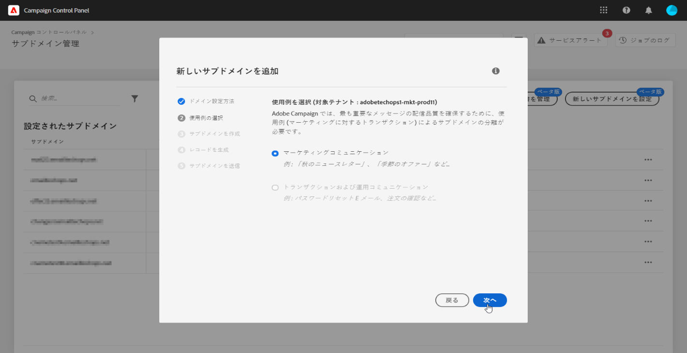
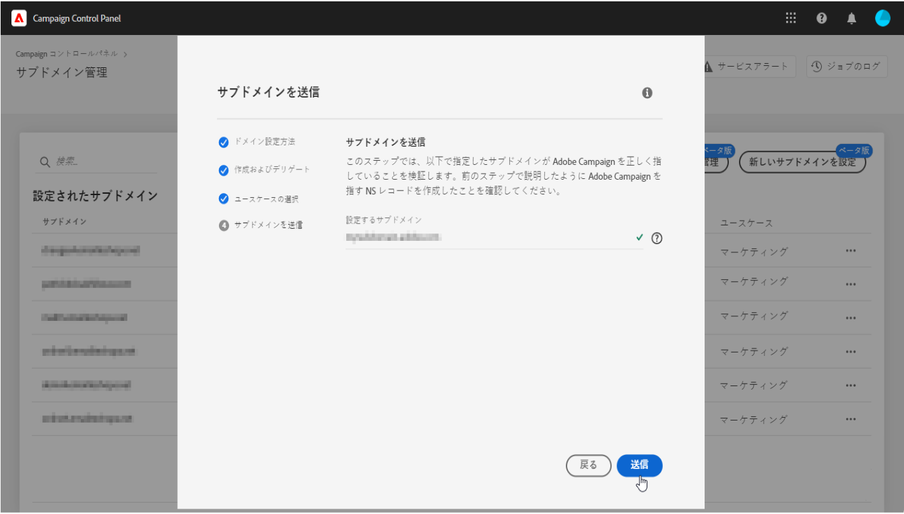

# 新しいサブドメインの設定 {#setting-up-subdomain}

>[!CONTEXTUALHELP]
>id="cp_subdomain_management"
>title="新しいサブドメインの設定と証明書の管理"
>abstract="Adobe Campaign で E メールの送信またはランディングページのパブリッシュを開始するには、新しいサブドメインを設定してサブドメインの SSL 証明書を管理する必要があります。"
>additional-url="https://docs.adobe.com/content/help/ja-JP/control-panel/using/subdomains-and-certificates/monitoring-ssl-certificates.html" text="サブドメインの SSL 証明書の監視方法"

>[!IMPORTANT]
>
>Campaign コントロールパネルから使用できるサブドメインの設定はベータ版であり、通知なしに頻繁に更新および変更される可能性があります。

このページでは、完全なサブドメインデリゲーションまたは CNAME を使用して新しいサブドメインを設定する方法について説明します。Global concepts on these two methods are presented in this section: [Subdomains branding](../../subdomains-certificates/using/subdomains-branding.md).

**関連トピック：**

* [サブドメインデリゲーション（チュートリアルビデオ）](https://docs.adobe.com/content/help/ja-JP/campaign-standard-learn/control-panel/subdomains-and-certificates/subdomain-delegation.html)
* [CNAMEを使用したサブドメインの設定（チュートリアルビデオ）](https://docs.adobe.com/content/help/ja-JP/campaign-classic-learn/control-panel/subdomains-and-certificates/delegating-subdomains-using-cname.translate.html)
* [サブドメインの監視](../../subdomains-certificates/using/monitoring-subdomains.md)

## 必読 {#must-read}

### インスタンスの選択

サブドメイン設定は、**プロダクション**&#x200B;インスタンスでのみ使用できます。

ウィザードで選択したインスタンスに、以前に設定されたサブドメインがない場合は、最初に設定されたサブドメインがそのインスタンスの&#x200B;**プライマリサブドメイン**&#x200B;となり、将来変更できなくなります。

その結果、このプライマリサブドメインを使用する他のサブドメインに対して、**DNS 逆引きレコード**&#x200B;が作成されます。**その他のサブドメインの返信アドレスとバウンスアドレスは、プライマリサブドメインから生成されます。**

### ネームサーバーの設定

ネームサーバーを設定する際は、**ルートサブドメインをアドビにデリゲートしない**&#x200B;ようにしてください。そうしないと、ドメインが機能できるのがアドビのみになります。例えば、組織の従業員に内部 E メールを送信するなど、他の使用はできなくなります。

また、この新しいサブドメイン用に&#x200B;**別のゾーンファイルを作成しない**&#x200B;でください。

## 完全なサブドメインデリゲーション {#full-subdomain-delegation}

サブドメインを Adobe Campaign に完全にデリゲートするには、次の手順に従います。

1. 「**[!UICONTROL サブドメインおよび証明書]**」カードで、目的のプロダクションインスタンスを選択し、「**[!UICONTROL 新しいサブドメインを設定]**」をクリックします。

   

1. 「**[!UICONTROL 次へ]**」をクリックして、完全デリゲーションの方法を確認します。

   

1. 組織で使用するホスティングソリューションに、目的のサブドメインとネームサーバーを作成します。これをおこなうには、ウィザードに表示される Adobe ネームサーバー情報をコピー＆ペーストします。ホスティングソリューションでのサブドメインの作成方法について詳しくは、[チュートリアルビデオ](https://video.tv.adobe.com/v/30175?captions=jpn)を参照してください。

   

1. 対応するアドビのネームサーバーの情報を使用してサブドメインを作成したら、「**[!UICONTROL 次へ]**」をクリックします。

1. Campaign Classic インスタンスを選択した場合、サブドメインの使用例（**マーケティングコミュニケーション**&#x200B;または&#x200B;**トランザクションおよび運用コミュニケーション**）を選択します。サブドメインの使用例に関する全体的な概念については、[この節](../../subdomains-certificates/using/subdomains-branding.md#about-subdomains-use-cases)で説明します。

   

1. 作成したサブドメインをホスティングソリューションに入力し、「**[!UICONTROL 送信]**」をクリックします。

   必ずデリゲートするサブドメインの&#x200B;**フルネームを**&#x200B;入力してください。例えば、「usoffers.email.weretail.com」サブドメインをデリゲートするには、&quot;usoffers.email.weretail.com&quot; と入力します。

   

サブドメインが送信されると、Campaign コントロールパネルで様々なチェックと設定手順が実行されます。詳しくは、「 [サブドメインの確認と設定](#subdomain-checks-and-configuration)」を参照してください。

## CNAME を使用したサブドメインの設定 {#use-cnames}

CNAME を使用してサブドメインを設定するには、次の手順に従います。

1. 「**[!UICONTROL サブドメインおよび証明書]**」カードで、目的のプロダクションインスタンスを選択し、「**[!UICONTROL 新しいサブドメインを設定]**」をクリックします。

   

1. 「**[!UICONTROL CNAME]**」メソッドを選択し、「**[!UICONTROL 次へ]**」をクリックします。

   

1. Campaign Classic インスタンスを選択した場合、サブドメインの使用例（**マーケティングコミュニケーション**&#x200B;または&#x200B;**トランザクションおよび運用コミュニケーション**）を選択します。サブドメインの使用例に関する全体的な概念については、[この節](../../subdomains-certificates/using/subdomains-branding.md#about-subdomains-use-cases)で説明します。

   

1. 作成したサブドメインをホスティングソリューションに入力し、「**[!UICONTROL 次へ]**」をクリックします。

   必ず設定するサブドメインの&#x200B;**フルネーム**&#x200B;を入力してください。例えば、「usoffers.email.weretail.com」サブドメインを設定するには、「usoffers.email.weretail.com」と入力します。

   

1. DNS サーバーに配置するレコードのリストが表示されます。これらのレコードを 1 つずつコピーするか、CSV ファイルをダウンロードしてから、ドメインのホスティングソリューションに移動して、一致する DNS レコードを生成します。

   

1. 前の手順のすべての DNS レコードが、ドメインホスティングソリューションで生成されていることを確認してください。すべてが正しく設定されている場合は、最初の文を選択し、「**[!UICONTROL 送信]**」をクリックして確認します。

   

   >[!NOTE]
   >
   >レコードを作成し、後でサブドメイン設定を送信する場合は、2 番目の文を選択し、「**[!UICONTROL 後で送信]**」をクリックします。その後、サブドメインの管理画面の&#x200B;**[!UICONTROL 処理中]**&#x200B;領域から直接サブドメイン設定を再開できます。
   >
   >サーバーに配置する DNS レコードは、Campaign コントロールパネルに 30 日間保持されます。その後は、サブドメインを最初から設定する必要があります。

サブドメインが送信されると、Campaign コントロールパネルで様々なチェックと設定手順が実行されます。詳しくは、「 [サブドメインの確認と設定](#subdomain-checks-and-configuration)」を参照してください。

## サブドメインのチェックと設定 {#subdomain-checks-and-configuration}

1. サブドメインが送信されると、Campaign コントロールパネルは、そのサブドメインが正しくアドビの NS レコードを指していることと、このサブドメインに対して SOA（Start of Authority）レコードが存在しないことを確認します。

   >[!NOTE]
   >
   >パフォーマンスの問題を回避するために、サブドメイン設定が実行される間は、Campaign コントロールパネルからのその他のリクエストはキューに入り、サブドメイン設定が完了した後で実行されます。

1. チェックが正常に完了すると、Campaign コントロールパネルで、DNS レコード、追加の URL、受信ボックスなどを含むサブドメインの設定が開始されます。

   

   サブドメイン設定の「**[!UICONTROL 詳細]**」ボタンをクリックすると、設定プロセスに関する詳細を取得できます。

   

1. 最終的に、監査するために、新しいサブドメインについて&#x200B;**配信品質チーム**&#x200B;に通知されます。監査プロセスは、サブドメインが設定されてから最大 10 営業日かかる場合があります。

   >[!IMPORTANT]
   >
   >実行される配信品質チェックには、フィードバックループや迷惑メール報告ループテストが含まれます。したがって、監査が完了する前にサブドメインを使用することはお勧めしません。サブドメインの評価が悪くなる可能性があります。

1. プロセスの最後に、Adobe Campaign インスタンスで機能するようにサブドメインが設定され、次の要素が作成されます。

   * **次の DNS レコードを持つサブドメイン**：SOA、MX、CNAME、DKIM、SPF、TXT
   * ミラー、リソース、トラッキングページ、ドメインキーをホストする&#x200B;**追加のサブドメイン**
   * **受信ボックス**：送信者、エラー、返信先

   デフォルトでは、コントロールパネルからの「返信先」受信ボックスは、E メールを消去するように構成され、再表示できません。マーケティングキャンペーンの「返信先」受信ボックスを監視する場合は、このアドレスを使用しないでください。

「**[!UICONTROL サブドメインの詳細]**」ボタンと「**[!UICONTROL 送信者情報]**」ボタンをクリックすると、サブドメインに関する詳細を取得できます。

## トラブルシューティング {#troubleshooting}

* 場合によっては、サブドメイン設定が処理されてもサブドメインが正しく検証されない場合があります。サブドメインは「**[!UICONTROL 設定済み]**」リストに残り、ジョブのログにエラーに関する情報が記録されます。問題が解決されない場合は、カスタマーケアにお問い合わせください。
* 設定後にサブドメインが「未検証」と表示される場合は、新しいサブドメイン検証（**...** ／**[!UICONTROL サブドメインを検証]**）を実行します。それでも同じステータスが表示される場合は、受信者スキーマに何らかのカスタマイズがおこなわれ、標準のプロセスを使用して検証できないことが原因である可能性があります。該当するサブドメインでキャンペーンを送信してみてください。
* 配信品質の監査手順でサブドメイン設定に時間がかかりすぎる（10 営業日を超える）場合は、カスタマーケアにお問い合わせください。
