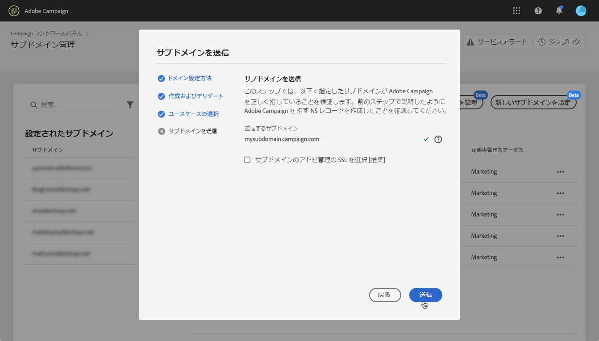

# 新しいサブドメインの設定 {#setting-up-subdomain}

## 完全なサブドメイン委任 {#full-subdomain-delegation}

コントロールパネルでは、サブドメインをAdobe Campaignに完全に委任できます。 これを行うには、次の手順に従います。

1. 「サブドメイ **[!UICONTROL ンと証明書]**」カードで、目的の実稼働用インスタンスを選択し、「新しいサブドメインを設**[!UICONTROL &#x200B;定」をクリックします]**。

   >[!NOTE]
   >
   >サブドメン委任は、実稼働インスタ **ンスで** のみ使用できます。

   

1. 「次へ ****」をクリックして、完全な委任方法を確認します。

   >[!NOTE]
   >
   >[CNAMEメソッドと](#use-cnames) 、カスタムメソッドは、現在、コントロールパネルではサポートされていません。

   

1. 組織で使用するホスティングソリューションに、目的のサブドメインとネームサーバーを作成します。 これを行うには、ウィザードに表示されるAdobe Nameserver情報をコピー&amp;ペーストします。

   ホスティングソリューションでのサブドメインの作成方法について詳しくは、このチュートリアルビデオを参照してください。

   

   対応するAdobeネームサーバー情報を使用してサブドメインを作成したら、「次へ」をクリッ **[!UICONTROL クします]**。

1. サブドメインの使用例を選択します。

   * **Marketing communications**:商用向けの通信。 例：販売の電子メールキャンペーン。
   * **トランザクションおよび運用の通信**:トランザクション通信には、受信者が自分と共に開始したプロセスの完了を目的とした情報が含まれます。 例：購入確認、パスワードリセット用の電子メール。 組織のコミュニケーションとは、組織内外の情報、アイデア、見解の交換を商業目的とせずに行うことです。
   >[!NOTE]
   >
   >配信品質を向上させるには、使用事例に従ってサブドメインを分類することがベストプラクティスです。 これにより、各サブドメインの評判が隔離され、保護されます。
   >
   >例えば、マーケティング通信用のサブドメインがインターネットサービスプロバイダーによってブラックリストに登録された場合、トランザクション通信サブドメインは影響を受けず、通信を送信でき続けます。

   

1. 作成したサブドメインをホスティングソリューションに入力し、「送信」をクリッ **[!UICONTROL クします]**。

   >[!NOTE]
   >
   > 委任するサブドメインのフルネ **ームを必ず** 、入力してください。 例えば、「usoffers.email.wetail.com」サブドメインを委任するには、「usoffers.email.wetail.com」と入力します。

   

1. サブドメインが送信されると、コントロールパネルは、そのサブドメインが現在Adobe NSレコードを指していること、およびこのサブドメインに対してSOA(Start of Authority)レコードが存在しないことを確認します。

1. チェックが正常に完了すると、コントロールパネルで、DNSレコード、追加のURL、inboxなどを含むサブドメインの設定が開始されます。 「 **[!UICONTROL Process details」ボタンをクリックすると、設定の進行状況に関する詳細を取得で]**きます。

   

プロセスの最後に、Adobe Campaignインスタンスで機能するようにサブドメインが設定され、以下の要素が作成されます。

* **次の** DNSレコードを持つサブドメイン ****:SOA、MX、CNAME、DKIM、SPF、TXT、
* **ミラー** 、リソース、トラッキングページ、ドメインキーをホストする追加のサブドメイン、
* **受信トレイ**:Sender、Error、Reply-to。

## CNAMEの使用 {#use-cnames}

サブドメイン委任に対するCNAMEの使用は、アドビでは推奨されず、コントロールパネルからはサポートされません。

この方法を使用するには、アドビカスタマーケアにお問い合わせください。
