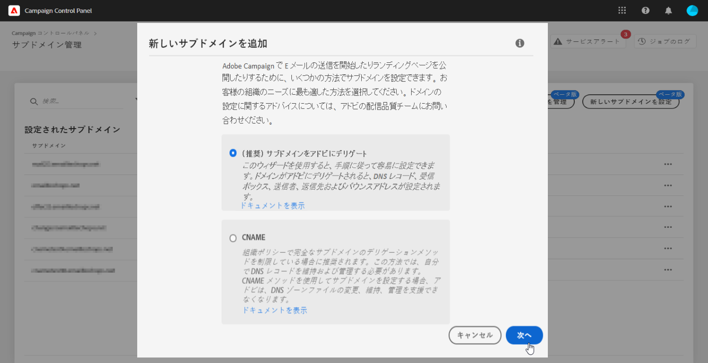
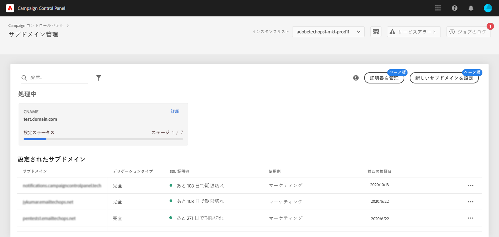

# 新しいサブドメインの設定 {#setting-up-subdomain}

>[!CONTEXTUALHELP]
>id="cp_subdomain_management"
>title="新しいサブドメインの設定と証明書の管理"
>abstract="Adobe Campaign で E メールの送信またはランディングページの公開を開始するには、新しいサブドメインを設定してサブドメインの SSL 証明書を管理する必要があります。"
>additional-url="https://experienceleague.adobe.com/docs/control-panel/using/subdomains-and-certificates/monitoring-ssl-certificates.html?lang=ja" text="SSL 証明書の監視"

## 必読 {#must-read}

このページでは、完全なサブドメインのデリゲーションまたは CNAME を使用して新しいサブドメインを設定する方法について説明します。これら 2 つの方法に関する全体的な概念については](../../subdomains-certificates/using/subdomains-branding.md)サブドメインのブランディング[の節で説明します。

**関連トピック：**

* [サブドメインの監視](../../subdomains-certificates/using/monitoring-subdomains.md)

### インスタンスの選択

サブドメイン設定は、**プロダクション**&#x200B;インスタンスでのみ使用できます。

ウィザードで選択したインスタンスに以前設定されたサブドメインがない場合は、最初に設定されたサブドメインがそのインスタンスの&#x200B;**プライマリサブドメイン**&#x200B;となり、後で変更することはできません。その結果、このプライマリサブドメインを使用する他のサブドメインに対して、**DNS 逆引きレコード**&#x200B;が作成されます。**その他のサブドメインの返信アドレスとバウンスアドレスは、プライマリサブドメインから生成されます。**

### アドビへのサブドメインの SSL 証明書のデリゲート

新しいサブドメインを設定する際に、SSL 証明書をアドビで管理できます。アドビで証明書を自動的に作成し、証明書の有効期限が切れる前に毎年更新するので、これを強くお勧めします。

CNAME を使用してサブドメインデリゲーションを設定している場合、アドビでは、証明書を生成するためにドメインホスティングソリューションに使用する証明書レコードを提供します。

>[!NOTE]
>
>アドビ管理の SSL は、ユーザーが無料で使用できる機能です。[詳しくは、SSL 証明書の管理を参照してください](monitoring-ssl-certificates.md#management)

### ネームサーバーの設定

ネームサーバーを設定する際は、**ルートサブドメインをアドビにデリゲートしない**&#x200B;ようにしてください。そうしないと、ドメインが機能できるのがアドビのみになります。例えば、組織の従業員に内部 E メールを送信するなど、他の用途には使用できなくなります。

また、この新しいサブドメイン用に&#x200B;**別のゾーンファイルを作成しない**&#x200B;でください。

## 完全なサブドメインのデリゲーション {#full-subdomain-delegation}

>[!CONTEXTUALHELP]
>id="cp_add_new_subdomain"
>title="新しいサブドメインを追加"
>abstract="アドビでは、完全なサブドメインのデリゲーションを推奨しています。 ただし、CNAME、つまりカスタムメソッドを使用してサブドメインをセットアップすることもできます。"
>additional-url="https://experienceleague.adobe.com/docs/control-panel/using/subdomains-and-certificates/setting-up-new-subdomain.html?lang=ja" text="新しいサブドメインの設定"
>additional-url="https://helpx.adobe.com/jp/enterprise/using/support-for-experience-cloud.html" text="カスタマーケアへの問い合わせ"

>[!CONTEXTUALHELP]
>id="cp_add_subdomain_create_delegate"
>title="サブドメインの作成とデリゲート"
>abstract="Adobe Campaign で使用するサブドメインをホスティングソリューションで作成して、アドビにデリゲートします。"
>additional-url="https://experienceleague.adobe.com/docs/control-panel/using/subdomains-and-certificates/setting-up-new-subdomain.html?lang=ja" text="新しいサブドメインの設定"

>[!CONTEXTUALHELP]
>id="cp_add_subdomain_submit"
>title="サブドメインの送信"
>abstract="前の手順で設定したサブドメインを確認して送信します。"
>additional-url="https://experienceleague.adobe.com/docs/control-panel/using/subdomains-and-certificates/setting-up-new-subdomain.html?lang=ja" text="新しいサブドメインの設定"

サブドメインを Adobe Campaign に完全にデリゲートするには、次の手順に従います。

[Campaign v7／v8](https://experienceleague.adobe.com/docs/campaign-classic-learn/control-panel/subdomains-and-certificates/subdomain-delegation.html?lang=ja#subdomains-and-certificates) または [Campaign Standard](https://experienceleague.adobe.com/docs/campaign-standard-learn/control-panel/subdomains-and-certificates/subdomain-delegation.html?lang=ja#subdomains-and-certificates) を使用して、ビデオでこの機能を確認

1. 「**[!UICONTROL サブドメインおよび証明書]**」カードで、目的のプロダクションインスタンスを選択し、「**[!UICONTROL 新しいサブドメインを設定]**」をクリックします。

   

1. 「**[!UICONTROL 次へ]**」をクリックして、完全デリゲーションの方法を確定します。

   

1. 組織で使用するホスティングソリューションに、目的のサブドメインとネームサーバーを作成します。これをおこなうには、ウィザードに表示される Adobe ネームサーバー情報をコピー＆ペーストします。ホスティングソリューションでのサブドメインの作成方法について詳しくは、[チュートリアルビデオ](https://video.tv.adobe.com/v/30175)を参照してください。

   >[!NOTE]
   >
   > Adobe Campaign Standard の場合、デリゲートされたサブドメインを使用すると、**マーケティング**&#x200B;と&#x200B;**トランザクション**&#x200B;の両方のやりとりを送信できます。

   

1. 対応するアドビのネームサーバーの情報を使用してサブドメインを作成したら、「**[!UICONTROL 次へ]**」をクリックします。

1. Campaign v7/v8 インスタンスを選択した場合、サブドメインに必要な使用例（**マーケティングコミュニケーション**&#x200B;または&#x200B;**トランザクションおよび運用コミュニケーション**）を選択します。サブドメインの使用例に関する全体的な概念については、[この節](../../subdomains-certificates/using/subdomains-branding.md#about-subdomains-use-cases)で説明します。

   

1. 作成したサブドメインをホスティングソリューションに入力し、「**[!UICONTROL 送信]**」をクリックします。

   必ずデリゲートするサブドメインの&#x200B;**フルネームを**&#x200B;入力してください。例えば、「usoffers.email.weretail.com」サブドメインをデリゲートするには、「usoffers.email.weretail.com」 と入力します。

1. サブドメインの SSL 証明書の生成をアドビにデリゲートするには、「**[!UICONTROL サブドメインのアドビ管理の SSL を選択]**」オプションを有効にします。[詳しくは、SSL 証明書のデリゲーションを参照してください](delegate-ssl.md)

   

サブドメインが送信されると、コントロールパネルで様々なチェックと設定手順が実行されます。詳しくは、[サブドメインのチェックと設定](#subdomain-checks-and-configuration)を参照してください。

## CNAME を使用したサブドメインの設定 {#use-cnames}

>[!CONTEXTUALHELP]
>id="cp_add_cname_subdomain_create_delegate"
>title="サブドメインの設定"
>abstract="この画面では、CNAME を使用して設定するサブドメインを指定します。"
>additional-url="https://experienceleague.adobe.com/docs/control-panel/using/subdomains-and-certificates/setting-up-new-subdomain.html?lang=ja" text="新しいサブドメインの設定"

>[!CONTEXTUALHELP]
>id="cp_add_cname_records"
>title="レコードを生成"
>abstract="この画面に表示されている DNS レコードのリストを生成するために、ホスティングソリューションに移動します。"
>additional-url="https://experienceleague.adobe.com/docs/control-panel/using/subdomains-and-certificates/setting-up-new-subdomain.html?lang=ja" text="新しいサブドメインの設定"

>[!CONTEXTUALHELP]
>id="cp_add_cname_subdomain_submit"
>title="サブドメインの送信"
>abstract="前の手順で設定したサブドメインを確認して送信します。"
>additional-url="https://experienceleague.adobe.com/docs/control-panel/using/subdomains-and-certificates/setting-up-new-subdomain.html?lang=ja" text="新しいサブドメインの設定"

CNAME を使用してサブドメインを設定するには、次の手順に従います。

[Campaign v7／v8](https://experienceleague.adobe.com/docs/campaign-classic-learn/control-panel/subdomains-and-certificates/delegating-subdomains-using-cname.html?lang=ja#subdomains-and-certificates) または [Campaign Standard](https://experienceleague.adobe.com/docs/campaign-standard-learn/control-panel/subdomains-and-certificates/delegating-subdomains-using-cname.html?lang=ja) を使用して、ビデオでこの機能を確認

1. 「**[!UICONTROL サブドメインおよび証明書]**」カードで、目的のプロダクションインスタンスを選択し、「**[!UICONTROL 新しいサブドメインを設定]**」をクリックします。

   

1. 「**[!UICONTROL CNAME]**」メソッドを選択し、「**[!UICONTROL 次へ]**」をクリックします。

   

1. Campaign v7/v8 インスタンスを選択した場合、サブドメインの使用例（**マーケティングコミュニケーション**&#x200B;または&#x200B;**トランザクションおよび運用コミュニケーション**）を選択します。サブドメインの使用例に関する全体的な概念については、[この節](../../subdomains-certificates/using/subdomains-branding.md#about-subdomains-use-cases)で説明します。

   

1. 作成したサブドメインをホスティングソリューションに入力します。

   サブドメインの SSL 証明書の生成をアドビにデリゲートするには、「**[!UICONTROL サブドメインのアドビ管理の SSL を選択]**」オプションを有効にします。[詳しくは、SSL 証明書のデリゲーションを参照してください](delegate-ssl.md)

   

   >[!NOTE]
   >
   >必ず設定するサブドメインの&#x200B;**フルネーム**&#x200B;を入力してください。例えば、「usoffers.email.weretail.com」サブドメインを設定するには、「usoffers.email.weretail.com」と入力します。

1. DNS サーバーに配置するレコードのリストが表示されます。これらのレコードを 1 つずつコピーするか、CSV ファイルをダウンロードしてから、ドメインのホスティングソリューションに移動して、一致する DNS レコードを生成します。

   

1. 前の手順のすべての DNS レコードが、ドメインホスティングソリューションで生成されていることを確認してください。すべてが正しく設定されている場合は、最初の文を選択し、「**[!UICONTROL 次へ]**」をクリックして確定します。

   レコードを作成し、後でサブドメイン設定を送信する場合は、2 番目の文を選択します。その後、サブドメインの管理画面の&#x200B;**[!UICONTROL 処理中]**&#x200B;領域から直接サブドメイン設定を再開できます。サーバーに配置する DNS レコードは、コントロールパネルに 30 日間保持されます。その後は、サブドメインを最初から設定する必要があります。

   >[!NOTE]
   >
   >SSL 証明書をアドビにデリゲートしないことを選択した場合、サブドメイン設定手順はこれが最後です。「**[!UICONTROL 送信]**」ボタンをクリックします。

   

1. サブドメインの証明書をアドビにデリゲートすることを選択した場合、証明書レコードが自動的に生成されます。これらのレコードを 1 つずつコピーするか、CSV ファイルをダウンロードしてから、ドメインホスティングソリューションに移動して、一致する証明書を生成します。

   

1. すべての証明書レコードがドメインホスティングソリューションに生成されていることを確認します。すべてが正しく設定されている場合は、最初の文を選択し、「**[!UICONTROL 送信]**」をクリックして確定します。

   

サブドメインが送信されると、コントロールパネルで様々なチェックと設定手順が実行されます。詳しくは、[サブドメインのチェックと設定](#subdomain-checks-and-configuration)を参照してください。

## サブドメインのチェックと設定 {#subdomain-checks-and-configuration}

1. サブドメインが送信されると、コントロールパネルは、そのサブドメインが正しくアドビの NS レコードを指していることと、このサブドメインに SOA（Start of Authority）レコードが存在しないことを確認します。

   >[!NOTE]
   >
   >パフォーマンスの問題を回避するために、サブドメイン設定が実行される間は、コントロールパネルからのその他のリクエストはキューに入り、サブドメイン設定が完了した後で実行されます。

1. チェックが正常に完了すると、コントロールパネルで、DNS レコード、追加の URL、受信ボックスなどを含むサブドメインの設定が開始されます。

   

   サブドメイン設定の「**[!UICONTROL 詳細]**」ボタンをクリックすると、設定プロセスに関する詳細を確認できます。

   

1. 最終的に、監査するために、新しいサブドメインについて&#x200B;**配信品質チーム**&#x200B;に通知されます。監査プロセスは、サブドメインが設定されてから最大 10 営業日かかる場合があります。

   >[!IMPORTANT]
   >
   >実行される配信品質チェックには、フィードバックループや迷惑メール報告ループテストが含まれます。したがって、監査が完了する前にサブドメインを使用することはお勧めしません。サブドメインの評価が悪くなる可能性があります。
   >
   >ただし、配信品質監査がまだ処理中の場合でも、サブドメインで SSL 証明書に関する操作を実行できます。

1. プロセスの最後に、Adobe Campaign インスタンスで機能するようにサブドメインが設定され、次の要素が作成されます。

   * **次の DNS レコードを持つサブドメイン**：SOA、MX、CNAME、DKIM、SPF、TXT
   * ミラー、リソース、トラッキングページ、ドメインキーをホストする&#x200B;**追加のサブドメイン**
   * **受信ボックス**：送信者、エラー、返信先

   デフォルトでは、コントロールパネルからの「返信先」受信ボックスは、E メールを消去するように構成され、再表示できません。マーケティングキャンペーンの「返信先」受信ボックスを監視する場合は、このアドレスを使用しないでください。

「**[!UICONTROL サブドメインの詳細]**」ボタンと「**[!UICONTROL 送信者情報]**」ボタンをクリックすると、サブドメインに関する詳細を確認できます。

## トラブルシューティング {#troubleshooting}

* 場合によっては、サブドメイン設定が処理されてもサブドメインが正しく検証されない場合があります。サブドメインは「**[!UICONTROL 設定済み]**」リストに残り、ジョブのログにエラーに関する情報が記録されます。問題が解決されない場合は、カスタマーケアにお問い合わせください。
* 設定後にサブドメインが「未検証」と表示される場合は、新しいサブドメイン検証（**...** ／**[!UICONTROL サブドメインを検証]**）を実行します。それでも同じステータスが表示される場合は、受信者スキーマに何らかのカスタマイズがおこなわれ、標準のプロセスを使用して検証できないことが原因である可能性があります。該当するサブドメインでキャンペーンを送信してみてください。
* 配信品質の監査手順でサブドメイン設定に時間がかかりすぎている（10 営業日を超える）場合は、カスタマーケアにお問い合わせください。
