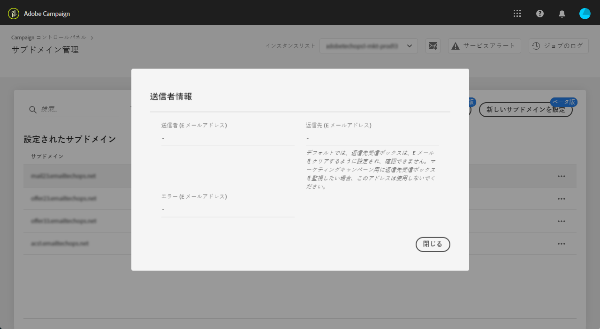

# 新しいサブドメインの設定 {#setting-up-subdomain}

>[!CONTEXTUALHELP]
>id="cp_subdomain_management"
>title="新しいサブドメインの設定と証明書の管理"
>abstract="Adobe Campaign で E メールの送信またはランディングページのパブリッシュを開始するには、新しいサブドメインを設定してサブドメインの SSL 証明書を管理する必要があります。"
>additional-url="https://docs.adobe.com/content/help/ja-JP/control-panel/using/subdomains-and-certificates/monitoring-ssl-certificates.html" text="サブドメインの SSL 証明書の監視方法"

>[!IMPORTANT]
>
>Campaign コントロールパネルのサブドメイン設定はベータ版で利用でき、頻繁な更新や変更が予告なく行われる場合があります。

このページでは、フルサブドメインの委任またはCNAMEを使用して新しいサブドメインを設定する方法について説明します。 この節では、これら2つの方法に関するグローバル概念について説明します。 .

**関連トピック：**

* [サブドメインデリゲーション（チュートリアルビデオ）](https://docs.adobe.com/content/help/en/campaign-learn/campaign-standard-tutorials/administrating/control-panel/subdomain-delegation.html)
* [CNAMEを使用したサブドメインの設定](https://docs.adobe.com/content/help/en/campaign-classic-learn/control-panel/subdomains-and-certificates/delegating-subdomains-using-cname.html)
* [サブドメインの監視](../../subdomains-certificates/using/monitoring-subdomains.md)

## 必読 {#must-read}

### インスタンスの選択

Subdomain configuration is available for **production** instances only.

ウィザードで選択したインスタンスに以前に設定したサブドメインがない場合は、最初に設定したサブドメインがそのインスタンスの **プライマリサブドメイン** となり、将来変更できなくなります。

その結果、 **このプライマリサブドメインを使用する他のサブドメインに対して** 、DNS逆引きレコードが作成されます。 **その他のサブドメインの返信アドレスとバウンスアドレスは、プライマリサブドメインから生成されます。**

### ネームサーバの設定

ネームサーバーを設定する際は、**ルートサブドメインをアドビにデリゲートしない**&#x200B;ようにしてください。そうしないと、ドメインが機能できるのがアドビのみになります。例えば、組織の従業員に内部 E メールを送信するなど、他の使用はできなくなります。

また、この新しいサブドメイン用に&#x200B;**別のゾーンファイルを作成しない**&#x200B;でください。

## 完全なサブドメインデリゲーション {#full-subdomain-delegation}

サブドメインをAdobe Campaignに完全に委任するには、次の手順に従います。

1. 「**[!UICONTROL サブドメインおよび証明書]**」カードで、目的のプロダクションインスタンスを選択し、「**[!UICONTROL 新しいサブドメインをセットアップ]**」をクリックします。

   

1. 「**[!UICONTROL 次へ]**」をクリックして、完全なデリゲーション方法を確認します。

   

1. 組織で使用するホスティングソリューションに、目的のサブドメインとネームサーバーを作成します。これをおこなうには、ウィザードに表示される Adobe ネームサーバー情報をコピー＆ペーストします。ホスティングソリューションでのサブドメインの作成方法について詳しくは、[チュートリアルビデオ](https://video.tv.adobe.com/v/30175?captions=jpn)を参照してください。

   

1. 対応する Adobe ネームサーバー情報を使用してサブドメインを作成したら、「**[!UICONTROL 次へ]**」をクリックします。

1. Campaign Classicインスタンスを選択した場合、サブドメインの使用例を選択します。 **マーケティングコミュニケーション** ( **トランザクションおよび運用上のコミュニケーション**) サブドメインの使用例に関するグローバル概念については、 [この節で説明し](../../subdomains-certificates/using/subdomains-branding.md#about-subdomains-use-cases)ます。

   

1. 作成したサブドメインをホスティングソリューションに入力し、「**[!UICONTROL 送信]**」をクリックします。

   必ずデリゲートするサブドメインの&#x200B;**フルネームを**&#x200B;入力してください。例えば、「usoffers.email.weretail.com」サブドメインをデリゲートするには、&quot;usoffers.email.weretail.com&quot; と入力します。

   

サブドメインが送信されると、Campaign コントロールパネルは様々なチェックと設定手順を実行します。 詳しくは、 を参照してください。

## CNAMEを使用したサブドメインの設定 {#use-cnames}

CNAMEを使用してサブドメインを設定するには、次の手順に従います。

1. 「**[!UICONTROL サブドメインおよび証明書]**」カードで、目的のプロダクションインスタンスを選択し、「**[!UICONTROL 新しいサブドメインをセットアップ]**」をクリックします。

   

1. 「 **[!UICONTROL CNAME]** 」メソッドを選択し、「 **[!UICONTROL 次へ]**」をクリックします。

   

1. Campaign Classicインスタンスを選択した場合、サブドメインの使用例を選択します。 **マーケティングコミュニケーション** ( **トランザクションおよび運用上のコミュニケーション**) サブドメインの使用例に関するグローバル概念については、 [この節で説明し](../../subdomains-certificates/using/subdomains-branding.md#about-subdomains-use-cases)ます。

   

1. Enter the subdomain that you created into your hosting solution, then click **[!UICONTROL Next]**.

   Make sure you fill in the **full name** of the subdomain to setup. 例えば、「usoffers.email.weretail.com」サブドメインを設定するには、「usoffers.email.weretail.com」と入力します。

   

1. DNSサーバーに配置するレコードのリストが表示されます。 これらのレコードを1つずつコピーするか、CSVファイルをダウンロードして、ドメインのホスティングソリューションに移動して、一致するDNSレコードを生成します。

   

1. 前の手順のすべてのDNSレコードが、ドメインホスティングソリューションで生成されていることを確認してください。 すべてが正しく設定されている場合は、最初の文を選択し、「 **[!UICONTROL 送信]** 」をクリックして確認します。

   

   >[!NOTE]
   >
   >レコードを作成し、後でサブドメイン設定を送信する場合は、2番目のステートメントを選択し、「 **[!UICONTROL 後で送信]**」をクリックします。 その後、サブドメインの管理画面の「 **[!UICONTROL 処理]** 」領域から直接サブドメイン設定を再開できます。
   >
   >サーバーに配置するDNSレコードは、Campaign コントロールパネル30日間保持されます。 その後、サブドメインを最初から設定する必要があります。

サブドメインが送信されると、Campaign コントロールパネルは様々なチェックと設定手順を実行します。 詳しくは、を参照してください。

## サブドメインのチェックと設定 {#subdomain-checks-and-configuration}

1. サブドメインが送信されると、Campaign コントロールパネルは、AdobeNSレコードが正しく指し示されていること、およびこのサブドメインに対して開始(SOA)レコードが存在しないことを確認します。

   >[!NOTE]
   >
   >サブドメイン設定の実行中は、Campaign コントロールパネルを介した他の要求はキューに入れられ、サブドメイン設定の完了後にのみ実行され、パフォーマンスの問題が発生しないようにすることに注意してください。

1. チェックが正常に完了すると、コントロールパネルで、DNS レコード、追加の URL、受信ボックスなどを含むサブドメインの設定が開始されます。

   

   You can get more details on the configuration progress by clicking the subdomain configuration **[!UICONTROL Details]** button.

   

1. 最終的に、監査するために、新しいサブドメインについて&#x200B;**配信品質チーム**&#x200B;に通知されます。監査プロセスには、サブドメインが設定されてから10営業日後までかかる場合があります。

   >[!IMPORTANT]
   >
   >実行される配信品質チェックには、フィードバックループやスパムループテストが含まれます。 したがって、監査が完了する前にサブドメインを使用することはお勧めしません。サブドメインの評価が悪くなる可能性があります。

1. プロセスの最後に、Adobe Campaign インスタンスで機能するようにサブドメインが設定され、次の要素が作成されます。

   * **次の DNS レコードを持つサブドメイン**：SOA、MX、CNAME、DKIM、SPF、TXT
   * ミラー、リソース、トラッキングページ、ドメインキーをホストする&#x200B;**追加のサブドメイン**
   * **受信ボックス**：送信者、エラー、返信先

   デフォルトでは、コントロールパネルからの「返信先」受信ボックスは、E メールを消去するように構成され、再表示できません。マーケティングキャンペーンの「返信先」受信ボックスを監視する場合は、このアドレスを使用しないでください。

「**[!UICONTROL サブドメインの詳細]**」ボタンと「**[!UICONTROL 送信者情報]**」ボタンをクリックすると、サブドメインに関する詳細を取得できます。

## トラブルシューティング {#troubleshooting}

* 場合によっては、サブドメイン設定が行われますが、サブドメインの検証が正常に行われない場合があります。 サブドメインは「**[!UICONTROL 設定済み]**」リストに残り、ジョブのログにエラーに関する情報が記録されます。問題が解決されない場合は、カスタマーケアにお問い合わせください。
* 設定後にサブドメインが「未検証」と表示される場合は、新しいサブドメイン検証（**...** ／**[!UICONTROL サブドメインを検証]**）を実行します。それでも同じステータスが表示される場合は、受信者スキーマに何らかのカスタマイズがおこなわれ、標準のプロセスを使用して検証できないことが原因である可能性があります。該当するサブドメインでキャンペーンを送信してみてください。
* 配信品質の監査手順でサブドメイン設定に時間がかかりすぎる（10 営業日を超える）場合は、カスタマーケアにお問い合わせください。
